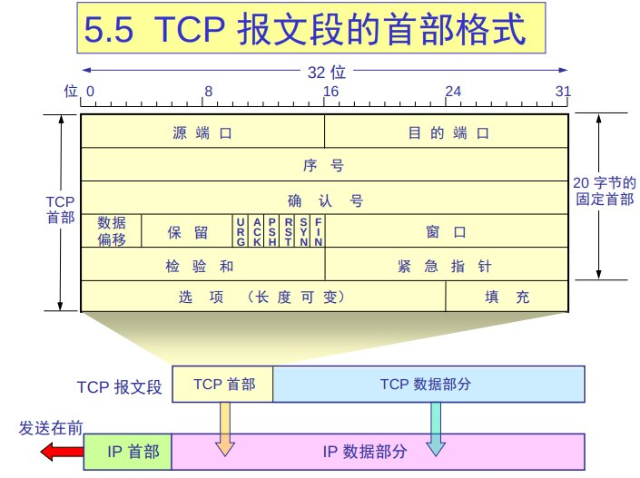

# 计算机网络

## 1. 概述

## 2. 应用层


### 电路交换 circuit-switching

频分，时分

建立连接 - 数据传输 - 释放资源

### 分组 (包) 交换 package-switching

为每一个连接只分配一小块资源，同时服务多个 (用户) 连接

端到端

- 所有数据包都是利用的完整的带宽，带宽不用分片
- 限制在交换机转发的能力

- 不需要预留资源
- 不需要提前和转发设备沟通，
- 需要存储转发
- 超过转发能力会有排队延迟，甚至产生丢包
  - 电路交换会限制发送速率，不会在中间产生不可用


## 3. 传输层

### 1. 传输层服务
1. 传输层和网络层的区别

- 网络层：主机间的逻辑通信
- 传输层：进程间的逻辑通信

传输层的服务 = 传输层的协议 + 网络层的服务

不同主机进程间数据传输 = 传输层的协议 + 进程所在主机间数据传输

发送端：

- 接收应用层的消息
- 设置报文头部字段的值
- 创建报文段
- 把报文端传递给对应 IP

接收端：

- 从某 IP 接收 报文段
- 检查 header 的值
- 解析应用层消息
- 通过 socket 把数据多路分解到应用

2. 两个传输层协议

TCP(Transmission Control Protocol):

- 可靠传输 (reliable, in-order delivery)
- 拥塞控制 (congestion control)
- 流量控制 (flow control)：确保发送端不会发送过多数据导致接收端 buffer 溢出而丢包的机制
- 面向建立

UDP(User Datagram Protocol):

- 不可靠传输 (unreliable, unordered delivery)
- 尽力而为 (no-frills extension of "best-effort" IP)

### 2. 多路复用 / 多路分解

_Multiplexing/demultiplexing_

- 创建 socket 时需要指定本机端口号
- 连接 UDP 时需要指定目的主机的 IP 和 端口号
- 当接收端接收到 UDP 报文后会检查目的端口，然口投递到对应的进程

TCP 面向连接，TCP socket 定义了一个四元组

总结

- UDP 多路分解只使用端口号
- TCP 多路分解使用 源和目地的 IP 和 端口
- 多路复用和多路分解发生在所有层

### 3. 无连接传输 UDP

#### UDP 特点

1. UDP 是一种尽力而为的协议

   - UDP 报文段可能会丢失
   - 也可能会乱序

2. 无连接
   - UDP 发送端和接收端不需要握手
   - 每一个 UDP 数据段都是独立的，上下可能没有关系
   - 只有 checkout 用于错误检验

#### 为什么需要 UDP？

1. 无连接简历（可能会增加延迟）
2. 简单，发送端和接收端不需要保存连接状态
3. 没有拥塞控制，UDP 会尽可能快的送达

应用场景：

流媒体 app
   - 低延迟
   - 速度敏感

如何在 UDP 上个构建可靠传输：在应用层上构建可靠性

#### UDP 报文段格式

```
+---------+---------+
| 源端口   | 目的端口 |
+---------+---------+
| 长度     | 校验和   |
+---------+---------+
| 应用数据（消息）     |
|                   |
+-------------------+
```

- 长度：UDP 报文段的长度（包含 header）
- 数据：上层协议数据，例如 DNS，SNMP
- checksum：错误检测（数学手段的冗余）

#### checksum 计算方法

将所有数据求和

- 假如发送 5 bit 数据 (7, 11, 12, 0, 6), 实际会发送 (7, 11, 12, 0, 6, 36)
- 接收方重新计算数字之和，并与收到的比较
- 发送方法送的是实际数据的反码 (-36), 被称为 checkout

问题

如何用 4 bit 表示 36 和 -36？

答：1s 补运算
- `36 = 0001 0100`
- `0100 + 0100 = 0110 = 6`
- `+6 = 0100 -6 = 1001 取反得到 -6`
- `-36 可以用 1001(9) 表示`

```
 1110 0110 0110 0110
 1101 0101 0101 0101

11011 1011 1011 1011
 1011 1011 1011 1100
```

### 4. 可靠传输

#### rdt

Rdt1.0:

1. 下层的 channel 是可靠的
   - 不会发生比特翻转
   - 不会丢包
2. 为 sender，receiver 设置不同的 FSM
   - sender 和 receiver 分别从下层的 channel 发送和接收数据

Rdt2.0:

- 发送端发送数据
- 接收端接收数据，如果接收到的数据正确，返回 ACK，如果数据错误，返回 NAK。
- 发送端根据收到的是 ACK 还是 NAK，选择重传

问题：

1. 出现比特翻转
   - 使用 checksum 检测错误
   - ack/nak 确认
   - 重传
2. 如何从错误恢复：
   - 自动请求重传
3. 新的状态机
   - sender 使用 udt_send 发送数据，发送完毕后等待接收 ACK。
   - 如果接收到了 ACK，就是成功。
   - 如果接收到了 NAK，就会重传。

缺点：

1. 如果接收方成功接收，但是返回失败，会导致消息不一致

rdt2.1:


解决同步问题 和 ACK/NAK 出错：

- 发送端发送的数据除了数据和 checksum 之外还有一个序列号
- 在接收端返回 ACK 或 NAK 是，还会返回序列号
- 发送端直到收到正确的序列化才会转换到下一个状态
- 是需要 0 和 1 两个状态其实就够了，区分新包和旧包

rdt2.2:

去掉 NAK，都用 ACK 表示：

- 发送方发送 ACK
- 接收方接收到数据，如果正确，返回原本的 ACK，如果错误，返回其他数据表示错误。
- 发送方检查 ACK，如果 ACK 相同，则切换到下一个状态


rdt3.0:

1. 可能发送丢包
   - 发送端等待一段时间，可能是数据丢了 或者 ACK 丢了，无法区分，统一重传
   - 等待多久，准本计数器，等待超时

#### Pipelined protocols (流水线)

提高效率，在发送端收到确认后可以发送更多数据

每次发送多份数据，当份数提高到一定程度，利用率就到 100%, 无法继续提高效率

1. go-Back-N

滑动窗口，重传很多

积累确认机制

- 发送方发送 5 个数据包
- 假如第 3 个丢失，接收方会返回错误的序号
- 发送端从这里重新发送

- 在接收方
- 如果到达分组是按序到达，那么发送 ACK，发送方正常移动窗口
- 如果不是按序到达，那么接收方丢弃所有失序分组；丢弃一个正确接收的失序分组可能会导致更多的重传
- 如果某个确认丢失，后续的确认（只有发送端正确接收到了数据才可能会有后续的确认）也能使发送端正常移动窗口

2. selective repeat(选择重传)

- 接收方因为有 buffer，所以不用按序接收分组，失序的分组会被缓存
- 发送方的 buffer，每个数据包都有各自的计数器，不用重传多的数据包

为了防止误判数据包

ACK 编号数量至少要 = 发送窗口 + 接收窗口

### TCP



- 源端口和目的端口字段：各占 2 字节。端口是运输层与应用层的服务接口。运输层的复用和分用功能都要通过端口才能实现。
- 序号字段：占 4 字节。TCP 连接中传送的数据流中的每一个字节都编上一个序号。序号字段的值则指的是本报文段所发送的数据的第一个字节的序号。
- 确认号字段：占 4 字节，是期望收到对方的下一个报文段的数据的第一个字节的序号。
- 数据偏移（即首部长度）：占 4 位，它指出 TCP 报文段的数据起始处距离 TCP 报文段的起始处有多远。“数据偏移”的单位是 32 位字（以 4 字节为计算单位）。
- 保留字段：占 6 位，保留为今后使用，但目前应置为 0。
- 紧急 URG：当 URG  1 时，表明紧急指针字段有效。它告诉系统此报文段中有紧急数据，应尽快传送 (相当于高优先级的数据)。
- 确认 ACK：只有当 ACK  1 时确认号字段才有效。当 ACK  0 时，确认号无效。
- 推送 PSH (PuSH)：接收 TCP 收到 PSH = 1 的报文段，就尽快地交付接收应用进程，而不再等到整个缓存都填满了后再向上交付。
- 复位 RST (ReSeT) ：当 RST  1 时，表明 TCP 连接中出现严重差错（如由于主机崩溃或其他原因），必须释放连接，然后再重新建立运输连接。
- 同步 SYN：同步 SYN = 1 表示这是一个连接请求或连接接受报文。
- 终止 FIN (FINis) ：用来释放一个连接。FIN  1 表明此报文段的发送端的数据已发送完毕，并要求释放运输连接。
- 窗口字段：占 2 字节，用来让对方设置发送窗口的依据，单位为字节。
- 检验和：占 2 字节。检验和字段检验的范围包括首部和数据这两部分。在计算检验和时，要在 TCP 报文段的前面加上 12 字节的伪首部。
- 紧急指针字段：占 16 位，指出在本报文段中紧急数据共有多少个字节（紧急数据放在本报文段数据的最前面）。
- 选项字段：长度可变。TCP 最初只规定了一种选项，即最大报文段长度 MSS。MSS 告诉对方 TCP：“我的缓存所能接收的报文段的数据字段的最大长度是 MSS 个字节。

TCP seq 序列号

#### TCP Feature

- Point to Point (单播，单发送者，单接收者)
- reliable, in-order byte stream
- pipelined（拥塞控制，流量控制）
- send & receive buffers
- full deplex data(全双工，双向数据传输，MSS(最大报文长度))
- connection-orinted(握手，初始化 sender 和 receiver 的状态)
- flow controlled(发送端不能超过接收端的处理能力)

### Flow Control

为什么需要流量控制？

- 发送者接收者的速率不一定匹配，如果发的快，可能产生消息堆积

如何解决？

- 接收端需要通知发送端自己的缓冲区大小，让它不要发送太多。对应的就是 TCP 协议中规定的 Receive Window (接收窗口) 字段

> 注意滑动窗口 (发送窗口)，接收窗口，以及之后的拥塞窗口的区别

### Congestion Control

#### 拥塞

- 太多发送源发送了太多的数据，超过了网络的承载能力
- 对资源需求的总和 > 可用资源
- 与流量控制不同
- 表现
   - 丢包
   - 高延迟
- top-10 question!

#### 解决方法

1. 端到端
   - 没有来自网络的明确反馈
   - 端系统通过丢包和延迟推测出可能通过拥塞
   - TCP 采用这种方法

2. 网络层辅助
   - 路由主动反馈给端系统
      - 由 1 个 bit 指出网络存在拥塞(SNA, DECbit, TCP/IP ECN, ATM)
      - 发送端需要以一个固定的速率发送数据

#### 三大问题

1. 如何限制发送速度？

   - Last Byte Sent(上一个发送的字节) - Last Byte Acked(最后确认的字节) < CongWin(拥塞窗口)

   - rate(发送速率) = CongWIn / RTT B/s

2. 如何检测到拥塞？
   loss event = timeout or 3 duplicate acks


3. 应该发送多快？

   - AIMD

      - 加法增加，乘法减小(additive increase, multiplicative decrease)
      - 增加有一个单位（1 字节，1k），一般以 MSS 数量为单位
      - 图像表现为锯齿状

   - slow start
      - 连接开始时，CongWin 为 1MSS，
         - 每次接收到 ACK，CongWin 就会乘 2
         - 慢启动其实并不慢，增加的速度很快
      - 速度增加有一定得阈值，当超过阈值后，到达新阶段，一般称为 "拥塞避免"，每次只会增加 1 个 MSS。


   - conservative after timeout events
      - 发生丢包后
         - 窗口掉回 1 MSS
         - 线性增加
      - 收到 3 个重复的 ACK
         - 窗口砍半
         - 线性增加
         - 快速重传
      - 新的阈值都为上次阈值的一半
      > 丢包相对于 3 个重复的 ACK 更严重

   - TCP CUBIC
      - 窗口减半后，增加的速度改为 `x^3` 的曲线

### TCP 公平性

AIMD 具有较好的公平性，使得不同连接占有的带宽相等

> 如果 TCP 和 UDP 同时竞争会怎样？TCP 会主动降低速度，UDP 则不管

> 想要可靠传输，不想要拥塞控制怎么办？在 UDP 的基础上自行实现可靠传输 (QUIC 就是这么干)

## 4. 网络层

### 简介

- 提供主机间的数据传输
- 发送端将段 (segments) 封装为数据报，接收端把 segments 发送到传输层
- 网络层协议在各个主机和路由间
- router 会确认经过他的所有 IP 数据报的 header 字段

### 转发 & 路由

路由：决定从发送源发送的 packets 到目的地的路径
   - 路由选择算法

转发：把 packets 从路由的输入转发到合适的输出
   - 如何通过某一个交换机

### 数据平面，控制平面

1. 数据平面

   - 局部的

2. 控制平面
   - 全局的
   - Per-router control plane
      - 每一个路由设备单独实现路由算法
   - Software-Defined Networking(SDN) control plane
      - 由一个集中式的计算机计算路由并向下发送了路由表

### 是否建立连接

- 三种重要的网络架构
   - ATM, frame relay, X.25
- 在数据报流动前，两个主机以及它们之间的路由会建立虚拟连接
- 网络层和传输层连接的区别
   - 网络层：两个主机之间 (也可能包含之间的交换机)
   - 传输层：两个进程之间

### 虚电路 & 数据报

- 虚电路
   - 有连接

- 数据报
   - 无连接

> 网络层应该是面向连接的还是无连接的？
> 在计算机通信中，可靠交付应该由谁来负责？是网络还是端系统？

转发表的建立

对于虚电路，转发表会在建立连接时产生

### IP 地址

_addressing, forwarding, routing_

- 地址块如何设计
- 对存储和转发的影响

#### IP 地址的编址方法

1. 分类的 IP 地址
   - 每一类地址都由两个固定长度的字段组成
      - 网络号 net-id: 标志主机（或路由器）连接到的网络
      - 主机号 host-id：标志该主机或路由器
   - 两级的 IP 地址可以记为：`IP 地址 ::= { <网络号>, <主机号>}`
   > `::=` 表示 "定义为"


|  网络类别    |   首部  |   地址范围           |
|----- |------|------------------------------|
| A 类 | 0    | 1.0.0.0 - 127.255.255.255    |
| B 类 | 10    | 128.0.0.0 - 191.255.255.255 |
| C 类 | 110  | 192.0.0.0 - 223.255.255.255  |
| D 类 | 1110 | 224.0.0.0 - 239.255.255.255  |
| E 类 |1111  |                              |

| 类别 | 最大网络数 | 第一个可用的网络号 | 最后一个可用的网络号 | 每个网络中的最大主技术 |
| A |  126(2^7 - 2)     | 1       | 126         | 16,777,214 |
| B | 16383(2^14 - 1)   | 128.1   | 191.255     | 65,534 |
| C | 2097151(2^21 - 1) | 192.0.1 | 223.255.255 | 254 |

- 私有地址

   - A: 10.0.0.0 - 10.255.255.255(10.0.0.0/8 prefix)
   - B: 172.16.0.0 - 172.31.255.255(172.16.0.0/12 prefix)
   - C: 192.168.0.0 - 192.168.255.255(192.168.0.0/16 prefix)

- 127.0.0.1: loopback
- 255.255.255.255:
- 0.0.0.0:

2. 子网的划分

3.  CIDR 方案
   - 无分类的编制方法

#### IP 地址的一些重要特点
- IP 地址是 "分等级" 的地质结构
   - 方便了 IP 管理：IP 管理机构分配 IP 时只分配网络号，剩下的交由单位自行管理
   - 减小了路由表的大小：路由器仅根据网络号来转发路由（不用考虑目的主机号），减少了路由表项数，减小了存储空间。
- 实际上 IP 地址标志一个主机和一条链路的接口
   - 当一个主机同时连接到两个网络上时，它必须同时有两个 IP 地址，并且 net-id 必须不同（称为多归属主机）
   - 一个路由器至少要连接到两个网络，才能将 IP 数据报总一个网络转发到另一个网络。因此路由器至少有两个不同的 IP 地址
- 用转发器或者网桥连接起来的若干局域网仍属以一个网络，这些局域网有相同的 net-id

#### 分类 IP 地址的路由转发

- direct delivery 直接投递/交付
- indirect delivery 间接投递/交付
- Route based，基于路径（构建转发表困难，维护难度大）
- Next hop based，基于下一跳（类似于 "路牌"）

1. 如果多个源 IP 有相同的下一跳，他们的目的地址可以合并

2. Default routing（缺省（默认）路由）

#### 划分子网和构造超网

1. 从两极 IP 到 三级 IP 地址
   原因：
      - IP 地址利用率低
      - 为每一个物理网络分配一个网络号会使路由表变大，降低性能
      - 两极 IP 地址不够灵活

2. 子网掩码

子网掩码前一部分为 1，后一部分全为 0，将子网掩码与 IP 地址进行 "与" 运算，就能找到 IP 地址的子网部分。

可以用来区分 net-id 和 host-id 或者 subnet-id 和 host-id

不同的子网掩码可以得到相同的网络地址，但是不同的掩码的效果是不同的。如果使用，路由器给出目的的网络地址外，还必须同时给出该网络的子网掩码。

若一个路由器连接在两个子网上，他就有两个网络地址和子网掩码

#### 无分类编址 CIDR

1. CIDR 特点
   - 消除了 A，B，C 类地址，以及划分子网的概念
   - 使用各种长度的 "网络前缀" 代替分类地址中的网络号和子网号。
   - 从三级编制（取消子网掩码）变回二级编制

2. 无分类的两级编址
   - IP 记法：`IP 地址 ::= {<网络前缀>, <主机号>}`
   - CIDR 还是用斜线记法：在 IP 地址面加一个 `/`，后面跟上网络前缀所占的位数。（对应子网掩码中 1 的个数）
   - 举例：128.14.32.0/20 `min: 128.14.32.0, max: 128.14.47.255`
   - 全 0 和全 1 一般不使用

3. 可变掩码长度向右移能划分为小块，向左移合并为大块
4. 路由聚合减少了路由表的表项

### IP 地址 

- 系统管理员将 IP 硬编码到文件中
   UNIX: /etc/rc.config

- DHCP: Dynamic Host Configuration Protocal:
   
   从服务器动态获取 IP

目的：允许主机加入网络后，从网络服务器，动态获取自己的 IP 地址。

- 支持重置，复用，手机用户

### DHCP

Overview

- 主机广播 "DHCP discover" 消息
- DHCP 服务器回复 "DHCP offer" 消息
- 主机请求 IP 地址："DHCP request" 消息
- DHCP 服务器发送地址："DHCP ack" 消息

### NAT 网络地址转换

#### 动机

对外部世界而言，本地网络只使用一个 IP 地址

- 不需要 ISP 提供一系列地址，所有设别共用一个 IP 地址。
- 无需通知外部实际就可以更换本地网络的设备 IP.
- 可以在不改变本地设备 IP 情况下更换 ISP.
- 内网对外不设备不可见。

#### 实现

NAT 路由必须

- 将每个向外发送数据报的源 IP 地址，端口替换为 NAT 的 IP 地址，新端口
   
   . .远程客户/服务器将使用 NAT 的 IP 地址，新端口作为目标地址进行响应。
- 在 NAT 转换表中记录每一个源 IP 地址，端口到 NAT IP 地址，新端口的映射
- 传入的数据报，将 NAT IP 地址和端口替换为 NAT 表中相应的源 IP 地址，端口。

#### NAT 的缺点
- 16 位端口号：60000 同时连接到同一个地址
- NAT 有争议
   - routers should only process up to layer 3
   - violates end-to-end argument(违背 e2e 原则)
   - NAT possibility must be taken into account by app designers, eg, P2P applications
   - address shortage should instead be solved by IPv6 

#### NAT 的问题

外部的客户端如何访问内网地址？
- 1. 静态配置端口转发
- 2. Universal Plug and Play (UPnP) Internet Gateway Device (IGD) Protocol. 
   - learn public IP address (138.76.29.7)
   - enumerate existing port mappings
   - add/remove port mappings (with lease times)
   > 自动配置静态端口映射

- 3. 中继 (Skype 使用)
   - 

### IP 数据报格式

首部 (20 字节固定 + 变长) + 数据


- 版本——占 4 位，指 IP 协议的版本，目前的 IP 协议版本号为 4 (即 IPv4)
- 首部长度——占 4 位，可表示的最大数值是 15 个单位 (一个单位为 4 字节) 因此 IP 的首部长度的最大值是 60 字节。
- 区分服务——占 8 位，用来获得更好的服务在旧标准中叫做服务类型，但实际上一直未被使用过。1998 年这个字段改名为区分服务。只有在使用区分服务（DiffServ）时，这个字段才起作用。在一般的情况下都不使用这个字段
- 总长度——占 16 位，指首部和数据之和的长度，单位为字节，因此数据报的最大长度为 65535 字节。总长度必须不超过最大传送单元 MTU。
- 标识 (identification) 占 16 位，它是一个计数器，用来产生数据报的标识。
- 标志 (flag) 占 3 位，目前只有前两位有意义。标志字段的最低位是 MF (More Fragment)。
   - MF = 1 表示后面“还有分片”。
   - MF = 0 表示最后一个分片。
   - 标志字段中间的一位是 DF (Don't Fragment) 。只有当 DF = 0 时才允许分片。
- 片偏移 (12 位) 指出：较长的分组在分片后某片在原分组中的相对位置。片偏移以 8 个字节为偏移单位。
- 生存时间 (8 位) 记为 TTL (Time To Live) 数据报在网络中可通过的路由器数的最大值。
- 协议 (8 位) 字段指出此数据报携带的数据使用何种协议以便目的主机的 IP 层将数据部分上交给哪个处理过程
- 首部检验和 (16 位) 字段只检验数据报的首部不检验数据部分。这里不采用 CRC 检验码而采用简单的计算方法。
- 源地址和目的地址都各占 4 字节