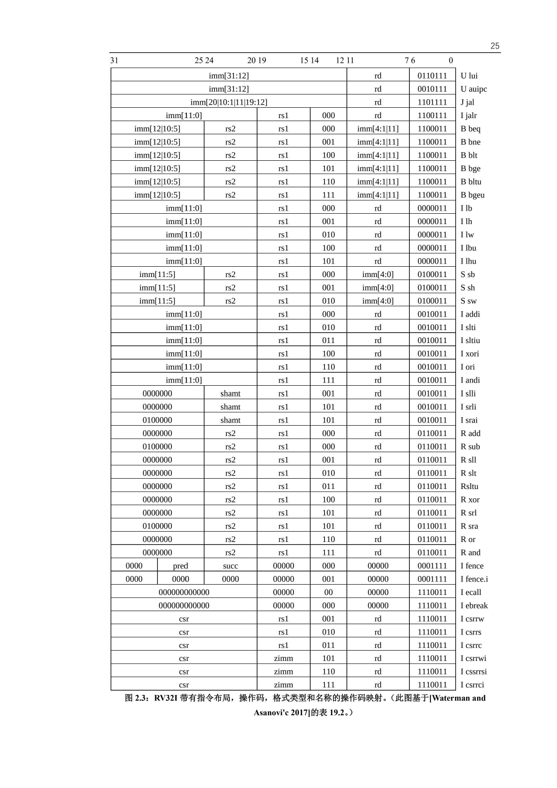
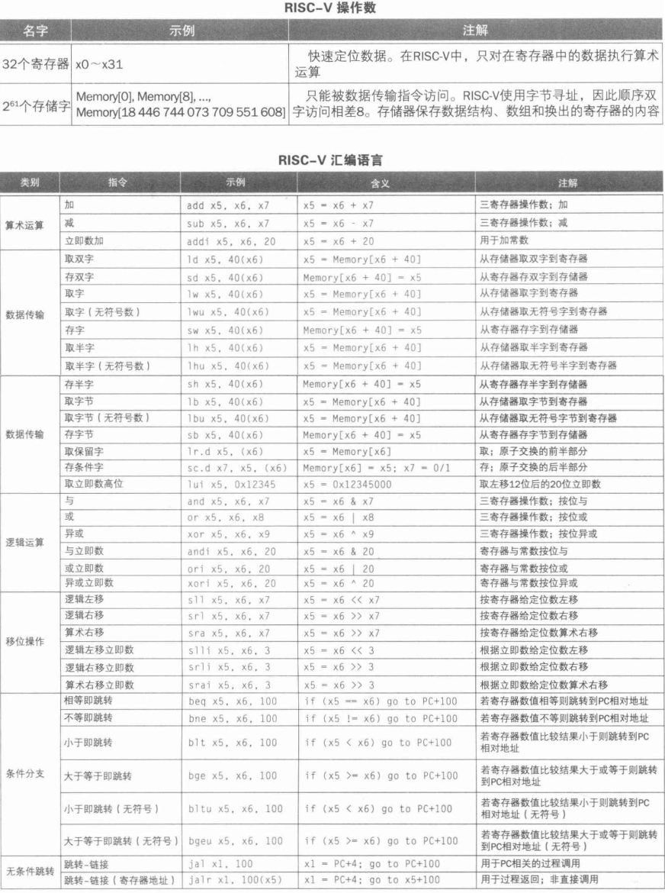
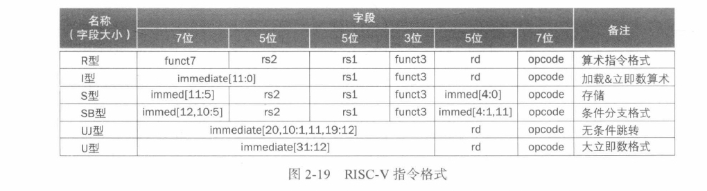
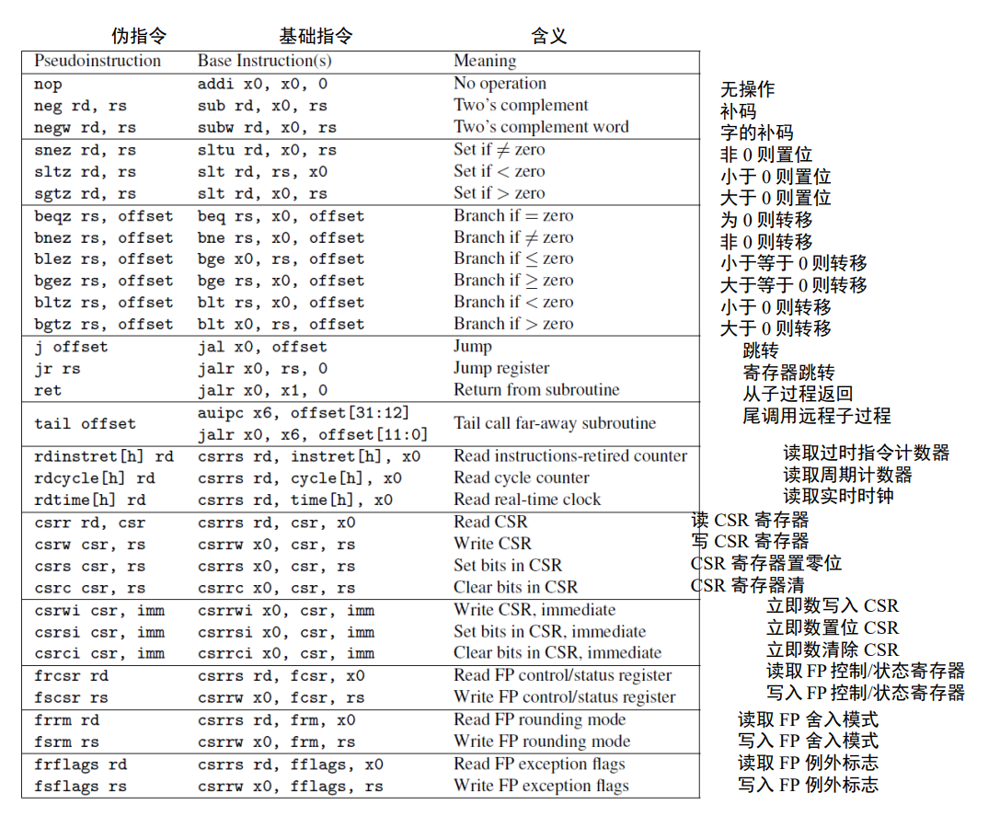
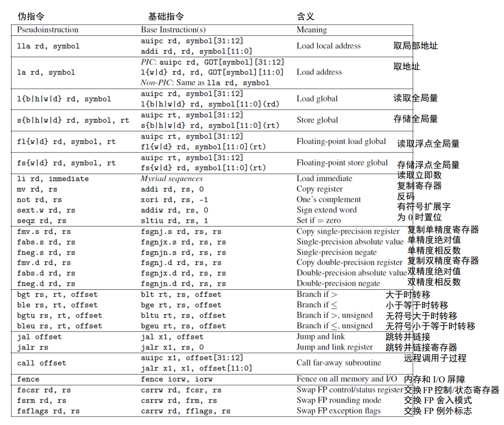

# RISC-V

## RISC-V 特点

1. 增量 ISA(指令集架构)

- 核心是名为 RV32I 的核心 ISA，它是固定的永远不会改变
- 可以增加拓展，例如 RV32IMDF 将乘法 (RV32M),单精度浮点 (RV32D) 和双精度浮点 (RV32D) 的拓展添加到了基础指令集中。
- RISC-V 编译器可以根据拓展生成当前硬件环境下的最佳代码

## ISA

### ISA 设计

- 成本
- 简洁性
  - ISA 的简洁性，从而缩小实现 ISA 的处理器的尺寸
- 性能
- 架构和具体实现的分离
- 提升空间
- 程序大小
- 易于编程/编译/链接

### RV32I 指令格式

六种基本指令格式分别是：

- 用于 `寄存器-寄存器` 操作的 R 类型指令
- 用于短立即数和访存 load 操作的 I 型指令
- 用于访存 store 操作的 S 型指令
- 用于条件跳转操作的 B 类型指令
- 用于长立即数的 U 型指令
- 用于无条件跳转的 J 型指令

优势：

- 指令只有六种格式，并且所有的指令都是 32 位长，这简化了指令解码
- 第二，RISC-V 指令提供三个寄存器操作数，而不是像 x86-32 一样，让源操作数和目的操作数共享一个字段。(节约了 1 条 move（搬运）指令)

### 寄存器

- RV32I 有 31 寄存器加上一个值恒为 0 的 x0 寄存器。
- ARM-32 只有 16 个寄存器
- x86-32 甚至只有 8 个寄存器。

1. 为常量 0 单独分配一个寄存器是 RISC-V ISA 能如此简单的一个很
大的因素。而 ARM-32 和 x86-32 指令集中没有零寄存器。

2. 程序计数器（PC）是 ARM-32 的 16 个寄存器之一，这意味着任何改变寄存器的指令
都有可能导致分支跳转。PC 作为一个寄存器使硬件分支预测变得复杂，因为在典型的 ISA
中，仅 10%-20% 的指令为分支指令，而在 ARM-32 中，任何指令都有可能是分支指令。而
分支预测的准确性对于良好的流水线性能至关重要。另外将 PC 作为一个寄存器也意味着
可用的通用寄存器少了一个。

| 寄存器 | 功能 |
|------|--------------|
|  x0 / szero  |  硬连线到 0 (Hardwired zero)   |
|  x1 / ra  |  返回地址 (Return address)  |
|  x2 / sp  |  栈指针 (Stack pointer)  |
|  x3 / gp |  全局指针 (Global pointer)  |
|  x4 / tp |  线程指针 (Thread pointer)  |
|  x5 / t0 |  临时 (Temporary)  |
|  x6 / t1 |  临时   |
|  x7 / t2 |  临时   |
|  x8 / s0 / fp |  保存寄存器 (saved register) / frame pointer   |
|  x9 / s1 |  保存寄存器   |
|  x10 / a0 |  函数参数 (Function argument), 返回地址   |
|  x11 / a1 |  函数参数，返回地址   |
|  x12 / a2 |  函数参数  |
|  x13 / a3 |  函数参数  |
|  x14 / a4 |  函数参数  |
|  x15 / a5 |  函数参数  |
|  x16 / a6 |  函数参数  |
|  x17 / a7 |  函数参数  |
|  x18 / s2 |  保存寄存器  |
|  x19 / s3 |  保存寄存器  |
|  x20 / s4 |  保存寄存器  |
|  x21 / s5 |  保存寄存器  |
|  x22 / s6 |  保存寄存器  |
|  x23 / s7 |  保存寄存器  |
|  x24 / s8 |  保存寄存器  |
|  x25 / s9 |  保存寄存器  |
|  x26 / s10 |  保存寄存器  |
|  x27 / s11 |  保存寄存器  |
|  x28 / t3 |  临时   |
|  x29 / t4 |  临时   |
|  x30 / t5 |  临时   |
|  x31 / t6 |  临时   |
| | |
| PS | 程序计数器 |

保存寄存器和临时寄存器为什么不是连续编号的？

为了支持 RV32E——一个只有 16 个寄存器的嵌入式版本的 RISC-V（参见第 11 章），只使用寄存器 x0 到 x15——一部分保存寄存器和一部分临时寄存器都在这个范围内。其它的保存寄存器和临时寄存器在剩余 16 个寄存器内。RV32E 较小，但由于和 RV32I 不匹配，目前还没有编译器支持。

## 计算机中的指令表示

### 指令






### 计算指令

- 简单计算：add, sub
- 逻辑指令：and, or, xor
- 移位指令：sll, srl, sra
- 小于时置位：slt, altu (unsigned), 立即数版 (slti，sltiu)

### 决策指令

#### 判断 (if-then-else)

```c
// f,   g,   h,   i,   j
// x19, x20, x21, x22, x23

if (i == g)
    f = g + h;
else
    f = g - h;
```

除了 Else 标签之外，还需要有一个 Exit 的标签，用于 If 执行完跳过 Else。

```assembly
    bne x22, x23, Else  // if
    add x19, x20, x21
    beq x0, x0, Exit    // 无条件分支的一种实现方法
Else: sub x19, x20. x21 // else
Exit:
```

#### 循环 (for / while)

```c
// i: x22, k: x24, save: x25
while (save[i] == k)
    i += 1;
```

- 将 `save[i]` 加载到临时寄存器里。
  - 加载 `save[i]` 前还需要得到它的地址，将 i 加到 save 的基址上。
  - 由于字节寻址问题，i 还需要乘 8。这个可以通过左移实现
  - 添加 Loop 标签

```asm
      slid x10, x22, 3  ; i * 8, 并存到 x10 里
      add x10, x10, x25 ; 在加上 save 基址
      ld x9, 0(x10)     ; 将 x10 存储到临时寄存器
Loop: bne x9, x24, Exit ; 比较
      addi x22, x22, 1  ; i = i + １
      beq x0, x0, Loop  ; 继续循环
Exit：
```

#### case / switch

实现方法：

1. 转换为一系列 if-then-else
2. 更高效的方法：使用分支地址表或分支表。

### 过程指令 (函数)

#### 过程调用时的寄存器的分配

- `x0` 硬连线为 0
- `x10 - x17`: 参数寄存器，用于传递参数或者返回值
- `x1`: 一个返回地址寄存器

#### 跳转指令

- `jal`: 跳转 - 链接指令

```asm
jal x1, ProcedureAddress
```

跳转到 ProcedureAddress 并把下一条指令的返回值保存到目标寄存器 **`rd`**.

> 在存储程序中，总需要一个寄存器存储当前指令的地址，这个寄存器被称为 "程序计数器", 缩写为 "PC".所以 `jal` 指令实际上是将 `PC + 4` 写入到 x1 中

- `jalr` 间接跳转，可以用于处理 case 语句。

```asm
jalr x0, 0(x1)
```

由于 x0 硬连线到 0，所以其效果是丢弃返回地址

当用户 `jal x1 X` `jalr x0, 0(x1)`

#### 使用更多寄存器

假设一个过程需要比 8 个更多的寄存器，需要将寄存器换出到存储器。

换出寄存器的理想结构是栈，栈中需要一个指针，指向下一个过程应该放置寄存器的位置（或者旧寄存器值的存放位置）。在 RISC-V 中，栈指针是 `x2` 也称 `sp`。

```c
// g: x10, h: x11, i: x12, j: x13
// f: x20
// 临时寄存器：x5, x6
long long int leaf_example(long long int g, long long int h, long long int i, long long int k) {
    long long int f;
    f = (g + h) - (i + j);
    return f;
}
```

汇编：

```asm
leaf_example:
    ; 压栈 (sd 从寄存器取双字到存储器)
    addi sp, sp, -24
    sd x5, 16(sp)        ; tmp1
    sd x6, 8(sp)         ; tmp2
    sd x20, 0(sp)        ; f

    ; 计算
    add x5, x10, x11     ; x5 = g + h
    add x6, x12, x13     ; x6 = i + j
    sub x20, x5, x6      ; f = x5 - x6

    ; 把返回值复制到一个参数寄存器
    addi x10, x20, 0     ; f -> x10

    ; 弹栈 (ld 从存储器取双字到寄存器)
    ld x20, 0(sp)
    ld x6, 8(sp)
    ld x5, 16(sp)
    addi sp, sp, 24

    ; 返回
    jalr x0, 0(x1)
```

上面使用了 x5 和 x6 作为临时寄存器，并假设它的旧值必须被保存和恢复。为了避免保存和恢复一个其值从没被用过的寄存器 (通常称为临时寄存器), RISC-V 把寄存器分为类两组：

- x5 ~ x7, x28 ~ x31: 临时寄存器，在过程调用时，不会被调用者保存。
- x8 ~ x9, x18 ~ x27: 保存寄存器 (saved register), 在过程调用中，必须被保存。

这一约定，减少了寄存器换出，x5, x6 不用保存，减少了两次存储和载入，x20 必须保存和恢复。

#### 嵌套过程

不调用其他过程的过程称为 leaf 进程

如何解决嵌套？

将其他所有必须保存的寄存器压栈。调用者将所有参数寄存器 (x10 ~ x17) 或临时寄存器 (x5~x7 和 x28 ~ x31) 压栈，被调用者将返回地址寄存器 x1 和被调用者使用的保存寄存器 (x8~x9 和 x18 ~ x27) 压栈。

```c
long long int fact(long long int n) {
    if (n < 1)
        return 1;
    else
        return n * fact(n - 1);
}
```

汇编：

```asm
fact:
    ; 压栈
    addi sp, sp, -16   ; 参数 n 和返回地址 x1
    sd x1, 8(sp)       ; 把返回地址 x1 存到 8[sp] 中
    sd x10, 0(sp)      ; 把 x10 [[参数 n]] 存到 0[sp] 中

    ; 判断
    addi x5, x10, -1   ; x5 = n - 1
    bge x5, x0, L1     ; if (n - 1 >= 0) goto L1;

    ; true
    addi x10, x0, 1    ; x10 = 1

    addi sp, sp, 16    ; 弹栈
    jalr x0, 0(x1)     ; 跳回去 x1
L1:
    ; false
    addi x10, x10, -1  ; [[x10 = n - 1]]
    jal x1, fact       ; fact // 这里发生递归

    addi x6, x10, 0    ; 把计算结果存到 x6

    ld x10, 0(sp)
    ld x1, 8(sp)
    addi sp, sp, 16    ; 弹栈

    mul x10, x10, x6   ; return n * fact(n - 1)
    jalr x0, 0(x1)
```

通过把返回地址 (PC + 4) 存到栈上实现了返回。

#### 尾递归

```c
long long int sum(long long int n, long long int acc) {
    if (n > 0)
        return sum(n - 1, acc + n);
    else
        return acc;
}
```

这种求和的递归可以用迭代高效实现

```asm
    ; 假设 x10 = n, x11 = acc, 结果放入 x12
sum:
    ble x10, x0, sum_exit
    add x11, x11, x10
    addi x10, x10, -1
    jal x0, sum
sum_exit:
    addi x12, x11, 0
    jalr x0, 0(x1)
```

### 字符处理指令

RISC-V 中一系列指令可以从双字中提取一个字节

- `lbu` (加载无符号字节): 从内存中加载一个字节，放到寄存器的最右边八位
- `sb` (存储字节): 从存储器最右边八位取一个字节并写入内存

```asm
lbu x12 0(x10) // read from x10
sb x12 0(x11)  // write to x11
```

字符串的设计：

1. 字符串第一位保留，表示字符串长度
2. 附加长度的变量（如结构体）
3. 字符串的结尾用一个字符标记结尾

`strcpy` 的汇编实现

```c
void strcpy(char x[], char y[]) {
    size_t i;
    i = 0;
    while ((x[i] = y[i]) != '\0') { // copy & test byte
        i += 1;
    }
}
```

假设 x: x10, y: x11, i: x19

```asm
strcpy:
    addi sp, sp, -8   ; 压栈
    sd x19, 0(sp)     ; 保存 i
    add x19, 0, 0;    ; i = 0 + 0
L1:
    add x5, x19, x11  ; 计算 数组基址 + 偏移量 (i)
    lbu x6, 0(x5)     ; 加载对应字节，注意：这里不用 *8，因为是字节数组

    bep x6, x0, L2
    addi x19, x19, 1  ; if (== '\0')
    jal x0, L1
L2:
    ld x19, 0(sp)     ; else
    addi sp, sp, 8    ; 弹栈
    jalr x0, 0(x1)    ; 返回
```

### 大立即数

假如常量超过了 12 位怎么办？

RISC-V 提供了 lui (load upper immediate) 指令 (取高位立即数)，能够将 20 位常量加载到寄存器的第 31 到 12 位。

将以下 64 位常量加载到寄存器 x19：

```asm
; 00000000 00000000 00000000 00000000 00000000 00111101 00000101 00000000


; 加载前 20 位
lui x19, 976                   ; 976: 00000000 00111101

; 此时 x19
; 00000000 00000000 00000000 00000000 00000000 00111101 00000000 00000000

; 加载后 12 位
addi x19, x19, 1280                             ; 1280: 00000101 00000000
```

### swap 和 排序

#### swap

```c
void swap(long long int v[], size_t k) {
    long long int temp;
    temp = v[k];
    v[k] = v[k + 1];
    v[k + 1] = temp;
}
```

手动把 C 翻译为 ASM 时，我们遵循一下步骤：

1. 为程序中的变量分配寄存器
2. 为过程生成汇编代码
3. 保存过程调用间的寄存器

下面是详细过程：

寄存器的分配。RISC-V 参数传递默认使用 x10 和 x17 寄存器，由于 swap 只有两个参数，所以可以在 x10 和 x17 保存。

还剩一个变量 temp，我们用 x5 保存它。

剩下的 C 过程代码：

```c
temp     = v[k];
v[k]     = v[k + 1];
v[k + 1] = tmep;
```

对应的 ASM:

```asm
; 使用数组基址 + 8 * i 计算地址
alli x6, x11, 3     ; reg x6 = k * 8
add  x6, x10, x6    ; reg x6 = x6 + (k * 8)

; 加载数组数据到寄存器
ld x5, 0(x6)        ; reg x5 (temp) = v[k]
ld x7, 8(x6)        ; reg x7        = v[k + 1]

; 把寄存器数据存入数组
sd x7, 0(x6)        ; v[k]     = reg x7
sd x5, 8(x6)        ; v[k + 1] = reg x5 (temp)
```

RISC-V 是字节寻址，双字之间相差了 8 个字节。

#### sort

```c
void sort(long long int v[], size_t int n) {
    size_t i, j;
    for (int i = 0; i < n; i += 1) {
        for (j = i - 1; j >= 0 && v[j] > v[j + 1]; j -= 1) {
            swap(v, j);
        }
    }
}
```

1. 寄存器的分配：

    v 和 n 两个参数保存在 x10 和 x11 中，我们将 i 和 j 两个临时寄存器分配在 x19 和 x20 (都是保存寄存器).

2. 翻译过程体代码：

    过程体由两层 for 循环和一个 swap 调用组成，我们从外到内展开代码。

##### 第一层 for 循环

`for (int i = 0; i < n; i += 1) {`:

for 循环分三步，对 i 做初始化，判断 `i < n` 和 `i += 1`, 分别对应下面的汇编指令：

```asm
; 初始化
li x19, 0         ; li 是汇编器提供的伪指令, 目的是简化汇编的编写

; i += 1
addi x19, x19, 1

; 判断 i < n
for1tst:
    beg x19, x11, exit1 ; 如果 i >= 0, 则退出
    j for1tst
exit1:
```

经过排序后：

```asm
li x19, 0
for1tst:
    bge x19, x11, exit1 ; 如果 i >= 0, 则退出
    ...
    ; i 循环的 body
    ...
    addi x19, x19, 1  ; i += 1
    j for1tst         ; 继续循环
exit1:
```

##### 第二层循环

`for (j = i - 1; j >= 0 && v[j] > v[j + 1]; j -= 1) {`

```asm
; 初始化
addi x20, x19, -1

; j -= 1
addi x20, x20, -1

; 判断条件,任意一个为假都要推出循环
for2tst:
    ; 判断 j >= 0
    ble x20, 0, exit2

    ; 判断 v[j]> v[j + 1]
    ; 先计算地址
    slii x5, x20, 8    ; reg x5 = j * 8
    add x5, x10, x5    ; reg x5 = v = j * 8
    ld x6, 0(x5)       ; 加载 v[j]
    ld x7, 8(x5)       ; 加载 v[j + 1]
    bge x6, x7, exit2  ; 比较
    ...
    (第二个循环的内容)
    ...
    addi x20, x20, -1  ; j -= 1
    j for2tst          ; 重复循环
exit2:
```

##### 调用 swap

调用 swap 很容易： `j x1 swap`

swap 需要 x10 (v) 和 x11 (k) 中的值，其中一种方法是：将 swap 的参数提前复制到其他寄存器中，使得 x10 和 x11 在调用 swap 时可用。

```asm
mv x21, x10 ; 把 x10 复制到 x21
mv x22, x11 ; 把 x11 复制到 x20
```

然后将这两个参数传递给 swap:

```asm
mv x10, x21 ; 把 x10 从 x21 恢复回去
mv x11, x20 ; ?
```

保留 sort 中的寄存器

```asm
sort:
    addi sp, sp, -40
    sd x1, 32(sp)       ; 返回地址
    sd x22, 24(sp)      ; 把 x22 保存到栈
    sd x21, 16(sp)      ; 同上
    sd x20, 8(sp)       ; 同上
    sd x19, 0(sp)       ; 同上
```

##### 完整过程

```c
void sort(long long int v[], size_t int n) {
    size_t i, j;
    for (int i = 0; i < n; i += 1) {
        for (j = i - 1; j >= 0 && v[j] > v[j + 1]; j -= 1) {
            swap(v, j);
        }
    }
}
```

- v 和 n 两个参数保存在 x10 和 x11 中，
- i 和 j 两个临时寄存器分配在 x19 和 x20 (都是保存寄存器).

```asm

sort:
    addi sp, sp, -40
    sd x1, 32(sp)       ; 返回地址
    sd x22, 24(sp)      ; 把 x22 保存到栈
    sd x21, 16(sp)      ; 同上
    sd x20, 8(sp)       ; 同上
    sd x19, 0(sp)       ; 同上

    ; 为 swap 保存参数
    mv x21, x10 ; 把 x10 (v) 复制到 x21
    mv x22, x11 ; 把 x11 (k) 复制到 x22

    ; 初始化 i = 0
    li x19, 0
for1tst:
    bge x19, x22, exit1 ; 如果 i >= 0, 则退出
    ; 初始化 j = i - 1
    addi x20, x19, -1   ; j = i - 1
for2tst:
    ; 判断 j >= 0
    ble x20, 0, exit2

    ; 判断 v[j]> v[j + 1]
    ; 先计算地址
    slii x5, x20, 8    ; reg x5 = j * 8
    add x5, x10, x5    ; reg x5 = v = j * 8
    ld x6, 0(x5)       ; 加载 v[j]
    ld x7, 8(x5)       ; 加载 v[j + 1]
    bge x6, x7, exit2  ; 如果 v[j] > v[j + 1], 则退出

    ; 恢复寄存器, 并调用 swap
    mv x10, x21
    mv x11, x20
    jal x1, swap

    addi x20, x20, -1  ; j -= 1
    j for2tst          ; 重复循环
exit2:
    addi x19, x19, 1  ; i += 1
    j for1tst         ; 继续循环
exit1:
    ld x19, 0(sp)
    ld x20, 8(sp)
    ld x21, 16(sp)
    ld x22, 24(sp)
    ld x1, 32(sp)
    addi sp, sp, 40
    jalr x0, 0(x1)
```

```asm
swap:
    ; 使用数组基址 + 8 * i 计算地址
    alli x6, x11, 3     ; reg x6 = k * 8
    add  x6, x10, x6    ; reg x6 = x6 + (k * 8)

    ; 加载数组数据到寄存器
    ld x5, 0(x6)        ; reg x5 (temp) = v[k]
    ld x7, 8(x6)        ; reg x7        = v[k + 1]

    ; 把寄存器数据存入数组
    sd x7, 0(x6)        ; v[k]     = reg x7
    sd x5, 8(x6)        ; v[k + 1] = reg x5 (temp)
```

### 数组和指针

```c
clear1(long long int array[], size_t int size) {
    size_t i;
    for (i = 0; i < size; i += 1) {
        array[i] = 0;
    }
}
clear2(long long int *array, size_t int size) {
    long long int *p
    for (p = &array[0]; p < &array[size]; p = p + 1) {
        *p = 0;
    }
}
```

假设 array: x10, size: x11, i: x5

```asm
    li x5, 0            ; i = 0
loop1:
    slii x6, x5, 3      ; i * 8
    add x7, x10, x6
    sd 0, 0(x7)         ; array[i] = 0
    addi x5, x5, 1
    ble x5, x11, loop1  ; if i < size; goto loop1
```

指针实现

```asm
    mv x5, x10          ; p(x5) = x10
loop2:
    sd x0, 0(x5)        ; 加载 *p
    addi x5, x5, 8      ; p = p + 8
    slli x6, x11, 3     ; x6 = size + 8
    add x7, x10, x6     ; x7 = &array[size]
    bltu x5, x7, loop2
```

这段代码可以优化，将计算 `&array[size]` 移动到外部：

```asm
    mv x5, x10          ; p(x5) = x10
    slli x6, x11, 3     ; x6 = size + 8
    add x7, x10, x6     ; x7 = &array[size]
loop2:
    sd x0, 0(x5)        ; 加载 *p
    addi x5, x5, 8      ; p = p + 8
    bltu x5, x7, loop2
```

减少了两条指令，这种优化对应分别于两种编译器优化：

- "强度削弱": 使用移位代替乘法
- 循环变量消除：消除循环内的数组地址计算

## 并发

这里介绍上锁 (lock) 和解锁 (unlock) 的同步实现

在多处理器中实现同步所需的关键是一组硬件原语，它们能够提供以原子方式读取和修改内存单元的能力。也就是说在内存单元的读取和写人之间不能插人其他任何操作。

> 如果没有这样的能力，构建基本同步原语的成本将会很高并会随着处理器数量的增加而急剧增加。

有许多基本硬件原语的实现方案，所有这些都提供了原子读和原子写的能力以及一些判断读写是否是原子操作的力法。

> 通常，体系结构设计人员不希望用户使用基本的硬件原语而是期望系统程序员使用原语来构建同步库，这个过程通常复杂且棘手。

我们从 **原子交换** (atomic exchange 或 atomic swap) 原语开始展示如何使用它来构建 基本同步原语。它是构建同步机制的一种典型操作，它将寄存器中的值与存储器中的值进行交换。

为了了解如何使用它来构建基木同步原语，假设要构建一个简单的锁变量，其中用 0 表示锁可用，用 1 用于表示锁已被占用。

处理器尝试通过将寄存器中的 1 与该锁变量对应的内存地址的值进行交换来设置加锁。如果某个其他处理器已声明访间该锁变量则交换指令的返回值为 1 表明该锁已被其他处理器占用，否则为 0 表示加锁成功。在后一种情况下，锁变量的值变为 1 以防止其他处理器也加锁成功

现在考虑两个处理器尝试同时进行交换操作：这种竞争会被阻止。因为其中一个处理器将首先执行交换并返回。而第二个处理器在进行交换时将返回 1。使用交换原语实现同步的关键是操作的原子性：交换是不可分割的．硬件将对两个同时发生的交换进行排序，尝试以这种方式设置同步变量的两个处理器都不可能认为它们同时设置了变量。

实现单个的原子存储操作为处理器的设计带来了一些挑战，因为它要求在单条不可中断的指令中完成存储器的读和写操作

另一种方法是使用指令对其中第二条指令返回一个值，该值表示该指令对是否被原子执行。如果任何处理器执行的所有其他操作都发生在该对指令之前或之后，则该指令对实际上是原子的。因此，当指令对实际上是原子操作时没有其他处理器可以在指令对之间改变值。

在 RISC-V 中，这对指令指的是一个称为 **保留加载 (load-reserved) 双字 (1 rd)** 的特殊加载指令，和一个称为 **条件存储 (store-conditional) 双字 (sc.d)** 的特殊存储指令。这些指令按序使用：

- 如果保留加载指令指定的内存位置的内容在条件存储指令执行到同一地址之前发生了变化，则条件存储指令失败且不会将值写人内存。
- 条件存储指令定义为将（可能是不同的）寄存器的值存储在内存中，如果成功则将另一个寄存器的值更改为 0 ,如果失败则更改为非零值。

因此，sc.d 指定了三个寄存器：

- 一个用于保存地址
- 一个用于指示原子操作的失败或成功
- 还有一个用于如果成功则将值存储在内存中。

由于保留加载指令返回初始位，并且条件存储指令仅在成功时返回 0，因此以下序列在寄存器 x20 中指定的内存位置上实现原子交换

```asm
again:
    lr.d x10, (x20)         ; 保留加载 load-reserved
    sc.d x11, x23, (x20)    ; 条件存储 store-conditional
    bne  x11, x0, again     ; 失败则重试
    addi x23, x10, 0        ; 保存加载到的值到 x23
```

详细阐述：虽然同步是为多处理器而提出的，但原子交换对于单个处理器操作系统中处理多个进程也很有用。为了确保单个处理器中的执行不受任何干扰，如果处理器在**两个指令对之间进行上下文切换**，则条件存储也会失败

详细阐述：保留加载/条件存储机制的一个优点是可以用于构建其他同步原语，例如原子的比较和交换 (atomic compare and swap) 或原子的取后加 (atomic fetch-and-increment), 这在一些并行编程模型中使用。这些同步原语的实现需要在 `lr.d` 和 `sc.d` 之间插入更多指令，但不会太多

由于条件存储会在另一个 store 尝试加载保留地址或异常之后失败，因此必须注意选择在两个指令之间插入哪些指令。特别是，只有保留加载/条件存储块中的整点算术、前向分支和后向分支被允许执行且不会出现问题；否则，可能会产生死锁情况 - 由于重复的页错误，处理器永远无法完成 `sc.d`。此外，保留加载和条件存储之间的指令数应该很少，以将由于不相关事件或竞争处理器导致条件存储频繁失败的可能性降至最低。

详细阐述：虽然上面的代码实现了原子交换，但下面的代码可以更有效地获取寄存器 x20 对应存储中的锁变量，其中值 0 表示锁变量是空闲的，值 1 表示锁变量被占用：

```asm
    addi x12, x0, 1         ; x12 设为 1
again:
    lr.d x10, (x20)         ; 读取锁状态
    bne x10, x0, again      ; 如果是 0
    sc.d x11, x12, (x20)    ; 把 1 存到 x20, 把 x20 返回到 x11
    bne x11, 0, again       ; 如果 x11 为 1, 说明已经被上锁, again
    sd x0, 0(x20)           ; 使用普通的存储指令就能释放锁
```

## 向量 or SIMD？

数组是一个常见的例子。虽然它是科学应用的基础，但它也被多媒体程序使
用。前者使用单精度和双精度浮点数据，后者通常使用 8 位和 16 位整数数据。

### SIMD

最著名的数据级并行架构是单指令多数据 (SIMD，Single Instruction Multiple Data)。
SIMD

- 它将 64 位寄存器的数据分成许多个 8 位、16 位或 32 位的部分，
然后并行地计算它们。
- 操作码提供了数据宽度和操作类型。
- 数据传输只用单个（宽）SIMD 寄存器的 load 和 store 进行。

### 向量

- 计算机从内存中中收集数据并将它们放入长的，顺序的向量寄存器中。在这些向
量寄存器上，流水线执行单元可以高效地执行运算。
- 向量架构将结果从向量寄存器中取出，并将其并分散地存回主存。
- 向量寄存器的大小由实现决定，而不是像 SIMD 中那样嵌入操作码中。

### 对比

**将向量的长度和每个时钟周期可以进行的最大操作数分离，是向量体系结构的关键所在**：

- 向量微架构可以灵活地设计数据并行硬件而不会影响到程序员，程序员可以不用重写代码就享受到长向量带来的好处。
- 向量架构比 SIMD 架构拥有更少的指令数量。
- 与 SIMD 不同，向量架构有着完善的编译器技术。

> 向量架构不如 SIMD 架构受欢迎的一个原因是：大家担心增加大型向量寄存器会延长中断时保存和恢复程序（上下文切换）的时间。动态寄存器类型对此很有帮助。程序员必须告诉处理器正在使用哪些向量寄存器，这意味着处理器需要在上下文切换中仅保存和恢复那些寄存器。RV32V 约定在不使用向量指令的时候禁用所有向量寄存器，这意味着处理器既可以具有向量寄存器的性能优势，又仅会在向量指令执行过程中发生中断时才会带来额外的上下文切换开销。早期的向量架构在发生中断时，不得不忍受保存和恢复全部向量寄存器的最大的上下文切换开销。

## 高级专题

### C，Java 与 Jit

为了保持可移植性并提高执行速度，Java 发展的下一阶段目标 是设计在程序运行时翻译的编译器。

这样的 **即时编译器（JIT)** 通常会对正在运行的程序进行剖视，以找到 "热点" 方法所在的位置，然后将它们翻译成（运行虚拟机的）宿主机对应的指令。编译过的部分将在下次运行程序时保存，以便每次运行时速度更快。这种解释和编译的平衡随着时间的推移而发展，因此经常运行的 Java 程序几乎没有解释的开销。

随着计算机的速度变得越来越快，编译器也变得更为强大，并且随着研究人员发明出更 好的动态编译 Java 的方法，Java 与 C 或 C+＋之间的性能差距正在缩小。

### 其他 IPS

### 总结

1. **简单源于规整**。规整性使 RISC-V 指令系统具有很多特点：所有指令都保持单一长度、算术指令中总是使用寄存器作为操作数、所有指令格式中寄存器字段都保持在相同位置。
2. **更少则更决**。对速度的要求导致 RISC-V 有 32 个寄存器而不是更多。
3. **优秀的设计需要适当的折中**。一个 RISC-V 的例子是，在指令中提供更大的地址和常 数．与保持所有的指令具有相同的长度之间的折中。

每种类型的 RISC-v 指令都与编程语言中出现的结构相关：

- 算术指令对应于赋值语句中的操作
- 传输指令最有可能发生在处理数组或结构体等数据结构时。
- 条件分支用于 if 语句和循环中。
- 无条件分支用于过程调用和返回，以及 case/switch 语句

这些指令出现频率不相等，少数常用指令在大多数指令中占主导地位。下图展示了 SPEC CPU 2006 的每类指令的出现频率。指令的不同出现频率在数据路径、控制和流水线中起着重要作用

| 指令类别 | RISC-V 实例 | 对应的高级语言 | 整数频率 | 浮点频率 |
|--------|-------------|--------------|---------|---------|
| 算术 | add, sub, addi | 赋值语句中的操作 | 6% | 48% |
| 数据传输 | ld, sd, lw, sw, lh, sh, lb, sb, lui | 对存储器中数据结构的引用 | 35% | 36% |
| 逻辑 | and, or, xor, sll, srl, sra | 赋值语句中的操作 | 12% | 14% |
| 分支 | beq, bne, blt, bge, bltu, bgeu | if 语句；循环 | 34% | 8% |
| 跳转 | jal, jalr | 过程调用&返回；switch 语句 | 2% | 0% |

## 翻译并启动程序

### 编译器

函数调用过程

函数调用过程通常分为 6 个阶段：

1. 将参数存储到函数能够访问到的位置；
2. 跳转到函数开始位置 (使用 RV32I 的 jal 指令)；
3. 获取函数需要的局部存储资源，按需保存寄存器；
4. 执行函数中的指令；
5. 将返回值存储到调用者能够访问到的位置，恢复寄存器，释放局部存储资源；
6. 返回调用函数的位置 (使用 ret 指令);

### 汇编器

ret 实际上是一个伪指令，汇编器会用 jalr x0, x1, 0 来替换它。大多数的 RISC-V 伪指令依赖于 x0。因此，把一个寄存器硬编码为 0 便于将许多常用指令——如跳转 (jump）、返回 (return)、等于 0 时转移 (branch on equal to zero)——作为伪指令，进而简化 RISC-V 指令集。




hello.c

```c
#include <stdio.h>
int main() {
    printf("hello, %s\n", "world");
    return 0;
}
```

hello.s

```asm
    ; Directive: enter text section         指示符: 进入代码段
    .text
    ; Directive: align code to 2^2 bytes    指示符: 按 2^2 字节对齐代码
    .align 2
    ; Directive: declare global symbol main 指示符: 声明全局符号 main
    .globl main
; label for start of main                   main 的开始标记
main:
    ; allocate stack frame                  分配栈帧
    addi sp, sp, -16
    ; save return address                   存储返回地址
    sw ra, 12(sp)
    ; compute address of string1            计算 string1 的地址
    lui a0, %hi(string1)
    ;   string1
    addi a0, a0, %lo(string1)
    ; compute address of string2            计算 string2 的地址
    lui a1, %hi(string2)
    ;   string2
    addi a1, a1, %lo(string2)
    ; call function printf                  调用 printf 函数
    call printf

    ; restore return address                恢复返回地址
    lw ra, 12(sp)
    ; deallocate stack frame                释放栈帧
    addi sp, sp, 16
    ; load return value 0                   读取返回值
    li a0, 0
    ; return                                返回
    ret

    ; Directive: enter read-only data section   指示符: 进入只读数据段
    .section .rodata
    ; Directive: align data section to 4 bytes  指示符: 按 4 字节对齐数据
    .balign 4
; label for first string                        第一个字符串标记
string1:
    ; Directive: null-terminated string         指示符: 空字符结尾的字符串
    .string "Hello, %s\n"
; label for second string                       第二个字符串标记
string2:
    ; Directive: null-terminated string         指示符: 空字符结尾的字符串
    .string "world"
```

hello.o

```asm
00000000 <main> :
 0: ff010113 addi   sp, sp, -16
 4: 00112623 sw     ra, 12(sp)
 8: 00000537 lui    a0, 0x0
 c: 00050513 mv     a0, a0
10: 000005b7 lui    a1, 0x0
14: 00058593 mv     a1, a1
18: 00000097 auipc  ra, 0x0
1c: 000080e7 jalr   ra
20: 00c12083 lw     ra, 12(sp)
24: 01010113 addi   sp, sp, 16
28: 00000513 li     a0, 0
2c: 00008067 ret
```

位置 8 到 1c 的这几条指令的地址为 0, 将被链接器填充。

## 特权架构

### 简介

为什么需要特权机架构？

1. 管理，保护共享资源

    - 共享资源：例如内存，IO 设备（音响，声卡输出），处理器核心

2. 对上层用户屏蔽下层实现细节

如何管理，保护：

- 内存：使用虚拟内存地址
- IO 设备：也使用虚拟内存地址
- 访问权限：

特权等级：

- M：机器（Machine）
- U：用户（程序执行）（User）
- S：监管（Supervisor）
- U：虚拟

不同的芯片有不同的使用场景，有不同的价格，实现了不同的特权机别

两种权限模式

- 运行最可信的代码的机器模式（machine mode）M-mode
- 以及为 Linux，FreeBSD 和 Windows 等操作系统提供支持的监管者模式（supervisor mode）。

> 处理器通常大部分时间都运行在权限最低的模式下，处理中断和异常时会将控制权移交到更高权限的模式。

### 特权级的组合

#### M-mode

机器模式（缩写为 M 模式，M-mode）是 RISC-V 中 hart（hardware thread，硬件线
程）可以执行的最高权限模式。

- 在 M 模式下运行的 hart 对内存，I/O 和一些对于启动和配置系统来说必要的底层功能有着完全的使用权。
- 是所有标准 RISC-V 处理器都必须实现的权限模式。实际上简单的 RISC-V 微控制器仅支持 M 模式。

- 可以在没有外部输入的情况下自己运行，没有什么外部网络接入（即程序在烧写之后也不会更新，上面的代码绝对安全），这时就不需要区分特权台和用户态，代码运行在最高权限下，应用层代码对 CPU 有完全的控制权，成本最低。
- M 态也可以运行例如 FreeRTOS 之类的操作系统实现分时多任务调度，但是因为没有实现内存保护，操作系统可能会被应用程序搞垮

#### M + U

- 增加了内存保护，操作系统可以运行在受保护的内存段里。运行在 U 态的应用程序无法修改运行在 M 态的操作系统。
- 可以接入网络，甚至能自己升级
- 应用程序出错不会影响操作系统，操作系统可以对出错做一些处理（善后工作）

#### M + S + U

- 引入了页表，从而可以实现虚拟内存等高级功能，实现了安全上的保障。

#### 对比 & 其他

特权级为什么不在操作系统层实现？

- 也可以，不过太常用，下放到了硬件
- 软件无法模拟（对内存的访问）

更高级别的特权级更强大

- 可以执行更多指令
- 可以操作更多 CSR（Control/State Register）

> 不同的 CSR 在不同的特权级可能会有不同的副本，例如 mtvec 和 stvec，一个是 M 态，一个是 S 态

#### 各特权态的指令

1. 各特权级都有的指令

    - ECALL

      - 实现特权级别的切换，通常是在 U 态（用户态）调用来陷入 S 态，在 S 态调用陷入 M 态。
        > 不过为了实现这种陷入关系，还需要额外的配置，见下文
      - ECALL 是单向的，需要用 SRET 返回
    - EBREAK
      - 产生断点异常，对于程序调试有帮助

    - FENCE.L
      - 产生一个内存读写屏障

    - SRET
      - 从 S 态返回 U 态（只有在支持在 S 态的 CPU 上才可以）

      > 还有一个 URET 指令

2. S 态引入的指令

    - SFENCE.VMA
      - 刷页表

3. M 态引入的指令

    - WFI
      - 让当前处理器进入休眠状态

#### 各特权态的 CSR

- CSR 寄存器有一套独立的地址空间，访问 CSR 需要使用专有指令
- 每一个处理器核心都有自己的一套独立的 4K CSR，均分给了 4 各特权态，对于每一个特权态，最多有 1024 个 CSR 寄存器可以使用。
- 访问没有权限的，不存在的，写只读的 CSR 都会 Trap。

RISC-V 只分配了 4K 的地址空间给 CSR，这 4K 空间的第 `[9:8]` 两个 bit 表示了 CSR 输入那个特权级

### 内存地址翻译：虚拟内存

- 在 RISC-V 下，页表最小为 4K
- 有多种地址映射方式（如 Sv32, Sv39, Sv48, 它们的虚拟地址的位宽不同，最大寻址范围也不同）
- 巨页！

#### 页表项结构

一个 RV32 Sv32 页表项

```txt
|32    20|19    10|9   8|7|6|5|4|3|2|1|0|
| PPN[1] | PPN[0] | RSW |D|A|G|U|X|W|R|V|
```

一个 RV32 Sv39 页表项

```txt
|63      54|53    28|27    19|18    10|9   8|7|6|5|4|3|2|1|0|
| Reserved | PPN[2] | PPN[1] | PPN[0] | RSW |D|A|G|U|X|W|R|V|
```

- V: 其他位是否有效（V=1 有效），如果 V = 0，则便利到该页表的会直接产生错误
- R | W | X：可读可写可执行。如果都是 0，则这个页表项是指向下一级页表的指针，否则它是页表树的一个页节点
- U：是否为用户界面。如果 U = 0，则 U 模式不能访问，但 S 可以，如果 U = 1，则 U 模式可以访问，但 S 不可以。对于云服务，用户数据安全也很重要，用户的私有数据也不是操作系统可以随便访问的。
- G：这个映射是否对所有虚拟内存都有效，硬件根据它提高地址转换性能

- A：是否被访问过（从上次清除开始）
- D：是否被写入过（从上次清除开始）

> A 和 D 可以用来判断缺页，mmap 文件映射到地址，判断是否要加载，是否要刷新

- RSW：留给操作系统使用，会被硬件忽略
- PPN:包含物理页号，是物理地址的一部分。
  - 若这个页表是一个页节点，则 PPN 是转换后物理地址的一部分
  - 否则，是下一个页表的地址

#### 内存屏障

S 态唯一引入的指令：SFENCE.VMA

只会刷新当前处理器的快表（页表缓存），如果是多核环境，还需要核间通信同步刷新其他核心的页表缓存

#### 内存保护

有两种机制

- 如果处理器支持，并且开启了内存地址转换（也就利用了页表），就可以通过页表里的权限位控制每个内存页的访问
- 如果不支持 S 态，可以通过 PMP（物理内存保护单元）。粒度大，保护区域小
- 虚拟内存优先于 PMP

### 中断与异常

机器模式最重要的特性是拦截和处理异常（不寻常的运行时事件）的能力。

RISC-V 将异常分为两类：

- （同步）异常
  - 同步事件
  - 发生原因明确，由具体的某一条指令导致。这类异常在指令执行期间产生，如访问了无效的存储器地址或执行了具有无效操作码的指令时。
- 中断。
  - 异步事件。它是与指令流异步的外部事件，比如鼠标的单击。
  - 有三种标准的中断源：软件、时钟和外部来源。软件中断通过向内存映射寄存器中存数来触发

- 中断和异常的处理流程几乎是一样的

### 和事件处理有关的 CSR

（说事件是因为它们异常和中断都能处理）

- stvec, mtved(Trap-Vector Base-Address Register)
  - 设置事件处理函数的地址，事件发生后会跳转到这里并执行对应的处理函数
  - 跳转策略有两种
    - 无论发生什么时间，都跳到同一个固定的位置执行处理函数
    > 然后再分发，虽然性能低，但是代码灵活

    - 通过向量表，根据事件编号跳到不同的地址。
    > 通常第二种的跳转效率比较高，但是逻辑死板

- medeleg，mideleg（Trap Delegation Register)
  - 决定发生事件时跳到那个特权级

- scause，mcause（Cause Register）
  - 存储时间发生原因的 ID，最高位是 1 表示中断，最高位 0 表示异常。

- stval，mtval（Trap Value Register）
  - 存储和事件相关的外部信息，例如非法地址，非法操作数，

- sepc，sstatus（Exception Program Register）
  - 记录从高特权级别返回低特权级时，要返回到的地址

- mstatus，sstatus（Status Register）
  - 记录一些常用的标志位

### Trap 的代理机制

通常事件发生就会直接跳转到 M 态，但是没必要。

一般是 `U -> S -> M`

直接调用 ECALL 会无条件跳转到 M 态，通过设置 medeleg 和 mideleg 能够实现在 U 态执行 ECALL 跳转到 S 态，在 S 态执行 ECALL 会跳转到 M 态。

### 异常

RISC-V 中实现精确例外：保证异常之前的所有指令都完整地执行了，而后续的指令都没有开始执行（或等同于没有执行）。

在 M 模式运行期间可能发生的同步例外有五种：

- 访问错误异常：当物理内存的地址不支持访问类型时发生（例如尝试写入 ROM）。
- 断点异常：在执行 `ebreak` 指令，或者地址或数据与调试触发器匹配时发生。
- 环境调用异常：在执行 `ecall` 指令时发生。
- 非法指令异常：在译码阶段发现无效操作码时发生。
- 非对齐地址异常：在有效地址不能被访问大小整除时发生，例如地址为 0x12 的 `amoadd.w`.

不同的异常对应不同的操作码

### 机器模式下的异常处理

八个控制状态寄存器（CSR）是机器模式下异常处理的必要部分：

- mtvec（Machine Trap Vector）它保存发生异常时处理器需要跳转到的地址。
- mepc（Machine Exception PC）它指向发生异常的指令。
- mcause（Machine Exception Cause）它指示发生异常的种类。
- mie（Machine Interrupt Enable）它指出处理器目前能处理和必须忽略的中断。
- mip（Machine Interrupt Pending）它列出目前正准备处理的中断。
- mtval（Machine Trap Value）它保存了陷入（trap）的附加信息：地址例外中出错
的地址、发生非法指令例外的指令本身，对于其他异常，它的值为 0。
- mscratch（Machine Scratch）它暂时存放一个字大小的数据。
- mstatus（Machine Status）它保存全局中断使能，以及许多其他的状态

## 页表

- 动态的申请内存
- 虚拟内存空洞
- 虚拟内存地址（VA），物理地址（PA）

```txt
| VA | PA | Size |
|    |    |      |
```

页表没有存在 PCB 中，位于一块单独的内存中。PCK 是一个相对紧凑的结构，里面存储了进程的状态，里面存储了页表的指针。当 CPU 切换进程时，还需要同时切换页表。

如何优化 VA 到 PA 的转换：

- 让硬件自动完成查表和转换
- 优化列表的存储数据结构，加快查找。

两种方案选择哪个呢？当然是两者都要 \doge。

### 硬件查表

引入了一个 MMU 的硬件电路来实现。为了让 MMU 也能查的更快，也需要给 MMU 提供一种更加优化的数据结构。

TLB 是 MLU 的一个子电路，包含了页表缓存，TLB 可以实现的很复杂，例如用硬件电路实现的 哈希表，LRU 算法等。

当切换进程时，TLB 也需要被清空吗？

TLB 如果足够复杂的话，它里面可以设置进程的标志位，不同的区块存储不同进程的页表缓存

### 优化存储数据结构

内存地址转换的最小单位是什么，或者说 Size 一列最小是多少。
假如以 1 字节为单位进行映射，那么映射以字节就需要存储 VA, PA, Size 一共 `3 * 4 = 12` 字节，属于是本末倒置了。

从而出现了页的概念。通常每个页的大小为 4KB，超过 4KB 的被称为巨页。最小的映射单元就是页。

我们把上面 VA 到 PA 的映射叫做页表，页表里的每一行映射关系被称为页表项。

#### 暴力存储

按照 VA 从小到大排序，检索时二分查找，复杂度 O(logN)

#### 页表存储

限制 Size 只能是 4KB，一次性把整个虚拟空间建立好映射关系

- Size 列可以去除
- 排序自然是排好的
- 复杂度为 O(1)，直接除 4096
- 映射表的 VA 列也不需要了，他可以用数组下标表示

以 32 位机器为例，4GB 的 VA，一共包含了 1M 个 4KB 页。等于要申请一个长度为 `1M = 1024 * 1024` 的大数组，每个数组元素是 PA，占 32bit，所以整个页表占 `1M * 4B = 4MB`

缺点

- 上面的是 Sv32，对于 Sv39，每个进程就要分配 512MB 内存，10 个进程就是 5GB
- 页表利用率低？

#### 多级页表

不是多有的进程都会使用完整的内存空间，虚拟地址空间里有很多的空洞，我们只需要把进程用到的 VA 做映射。所以我们现在的的目的是优化如何存储一个非常稀疏的数组。

地址是一个数，**越高位表示的范围就越大**，这是一种编码的思路。

具体到页表上，我们也可以把 32 各比特位划分为 `10 + 10 + 12` 三段，实现多级页表。前十位指向一级页表，中间 10 位指向二级页表，最后 10 位指向物理地址。

异同：

- 需要查两次表，但是从时间复杂度上来看，这是一个常数级别的操作，仍然是 O(1)
- 由于构造的是树形结构，刚开始只需要存储树根，某些二级页表的 VA 从来没有被使用过，所以这一部分对应的的二级页表就不用存储。需要时随便找到一块 4KB 的空间就行，具有高效的插入和删除。

#### RISC-V 中的实现

Sv32，Sv39，Sv48 各种页表都有不同的划分

RISC-V 32 实际上有 34 位 12 + 10 + 12。芯片引用到 16 GB 的内存，但是进程依然只能访问 4GB 的空间。

一级、二级页表本身的地位都为 0，这些位被拿来做其他事了，提供了更丰富的功能，不只是地址映射，具体见 [页表项结构](#页表项结构)。

#### 如何在多进程间切换页表？

每个进程都有自己的页表，每个页表都是一棵树，都有一个树根，这个树根也是一个大小为 4KB 的内存区域，只要我们能够知道这个区域（树根）的首地址，就相当于知道了整个页表

所以在 RISC-V 里，S 态引入了一个叫做 satp 的寄存器，apt 是 `Address.Translation and Protection`，即地址翻译和保护。这个地方存储的就是当前进程的根页表的页号，切换时就修改它的值。

#### Copy On Write 的实现

当进行 fork 时，操作系统会把父进程的页表项都设置为只读，并把父进程的页表项复制一份给子进程（这里指的应该是一级页表）。所以子进程和父进程其实共享相同的物理内存（两个进程各自的 VA 映射到同一个 PA）。

只要父进程和子进程都只进行读操作，那么就无事发生。假如进行写操作，因为现在父子进程都是只读的，会触发一个异常，从 U 态陷入 S 态。此时有操作系统接管执行权，根据异常的原因发现是要修改共享的内存，于是操作系统就：

- 为子进程重新分配一个页面
- 然后把子进程的页表项指向新的页面
- 并把这块内存在父子进程中都改为可读可写
- 最后返回用户态。

> 回顾中断和异常，这里的就是异常，trap 处理结束后会重新跳到导致异常的指令（即重试），程序就像什么都没发生一样。

通过这种方式我们就实现了 COW，以 4KB 为单位，用多少内存就复制多少内存。

#### Mmap 的实现

也是通过设置页表权限，然后引发异常，操作系统做一番操作。

当用户要把硬盘上的某个文件映射到内存的某个地址空间里时，就可以先在页表项里把这一段 VA 对应的内存映射到一块物理内存上，然后把硬盘文件里的数据加载到对应的物理内存对应的区域里。

如果映射的文件很小，那就可以把文件一次性读到内存。

如果文件很大，我们可以先在 VA 里把文件的内存空间都分配好页表，但是不指向具体的物理内存，同时设置读写权限。

- 当程序读内存时，同样会触发陷入，然后操作系统会根据读写的地址将磁盘文件对应的区块加载到内存里，然后再修改页表。
- 当写内存时，对应的页表项的 D 标志位被设为 1，操作系统会有一个后台线程定期检查哪些页表是脏的，并把脏页刷回到内存。
