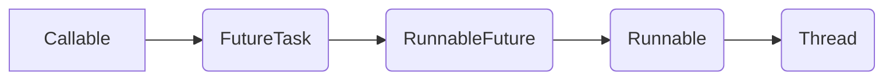

# 基础知识

## 语法细节

### for(;;)和while(true)的区别

虽然两者都能实现死循环, 但是源码中都是选择for(;;)
原因:
```doc
编译前              编译后 
while (1)           mov eax,1  
                    test eax,eax 
                    je foo+23h
                    jmp foo+18h

编译前              编译后 
for (;;)          jmp foo+23h 　　
```
对比之下，for (;;)指令少，不占用寄存器，而且没有判断跳转，比while (1)好。
也就是说两者在在宏观上完全一样的逻辑，但是底层完全不一样，for相对于来说更加简洁明了。

### equal与==的区别
1. 区别
- ==是运算符, equal是方法, 
- 比较基本类型: 只能用==, 不能用equal
- 比较包装类型: ==比较的是内存地址, 而equal比较的是值
- 比较对象: ==和equal比较的都是内存地址，因为equal没有被重写，没有被重写的equal都是object的equal方法
::: warning 注意
String（还有Date，Integer）类型重写了equals方法，使其比较的是存储对象的内容是否相等，而不是堆内存地址。
:::


### Class.this和this的区别
当inner class（内部类）必顺使用到outer class（外部类）的this instance（实例）时，或者匿名内部类要使用外部类的实例。

### 待续...

## 包装类

### int VS Integer

##### 初始化
- 1
int类的变量初始为0.
Integer的变量则初始化为null.
- 2
Integer变量必须实例化后才能使用，
int变量不需要 .
- 3
在Int是将值直接存储，
Integer对象是生成指针指向此对象。


##### 比较
1. Integer ? int <br/>
只要两个变量的值是向等的，则结果为true。 因为包装类Integer和基本数据类型int比较时，java会自动拆包装为int，然后进行比较，实际上就变为两个int变量的比较。
2. new Integer() ? !new Integer()，<br/>
结果为false
! new Integer()当变量值在-128~127之间时，非new生成的Integer变量指向的是java常量池中cache数组中存储的指向了堆中的Integer对象，
而new Integer()生成的变量指向堆中新建的对象，两者在内存中的地址不同；
3. new Interger() ? new Integer() <br/>
false
4. !new Integer() ? !new Integer() <br/>
如果两个值相等,且在区间-128到127之间则true
只要不同或者有值在区间外就不相同


##### 应用
```java
Integer a = Integer.parseInt("1");
Integer b = Integer.parseInt("1");
synchronized(i)
```


## "析构函数"
java提供finalize()方法，垃圾回收器准备释放内存的时候，会先调用finalize()。
- 特征
1. 对象不一定会被回收。
2. 垃圾回收不是析构函数。
3. 垃圾回收只与内存有关。
4. 垃圾回收和finalize()都是靠不住的，只要JVM还没有快到耗尽内存的地步，它是不会浪费时间进行垃圾回收的。

- 应对方法
1. 主动调用System.gc() 方法强制垃圾回收器来释放这些对象的内存。
2. Java 1.1 通过提供一个System.runFinalizersOnExit() 方法，不象System.gc() 方法那样，System.runFinalizersOnExit() 方法并不立即试图启动垃圾回收器。而是当应用程序或 Applet 退出时，它调用每个对象的finalize() 方法。
3. 继承finalize()

## 泛型

### T的位置

1. 示例
```java
static <T> void show(Collection<T> C) {
    System.out.println("使用泛型 ------->" + C);
}
```
2. 解释
- 第一处: 静态方法不能直接引用类定义处的泛型, 需要提前定义好泛型才能使用
- 第二处: 指定Collection的元素类型为T

### 边界通配符

`<? extends T>和<? super T>`
1. 引例
- 这种情况下是可行的
```java
Plate<Fruit> plate = new Plate<>(apple);
```
- 这种情况下, 虽然苹果和水果有继承关系, 但盘子间没有继承关系会报错
```java
Plate<Fruit> plate = new Plate<Apple>(apple);
```

2. 上下界通配符
- Apple -> Fruit -> Food
- <? extends T> 可以是任何T的子类
```java
Plate<? extends Food> plate = new Plate<Fruit>(apple);
```
- <? super T> 可以是任何T的父类
```java
Plate<? super Apple> plate = new Plate<Food>(fruit);
```

3. 上下界通配符的副作用
- 上界<? extends T>不能往里存，只能往外取
```java
Plate<? extends Food> plate = new Plate<Fruit>(apple);
Food a = plate.getItem();  
// plate.setItem(food);  失效
```
- 下界<? super T>不影响往里存，但往外取只能放在Object对象里
```java 
Plate<? super Apple> plate = new Plate<Food>(fruit);
plate2.setItem(apple);
// Apple b = plate2.getItem(); 失效
// 元素的类型信息全部丢失。
```
::: tip 补充
- ?与T的区别
- 对编译器来说所有的T都代表同一种类型。比如下面这个泛型方法里，三个T都指代同一个类型，要么都是String，要么都是Integer。
- 但通配符<?>没有这种约束，Plate<?>单纯的就表示：盘子里放了一个东西，是什么我不知道。
所以题主问题里的错误就在这里，Plate<？ extends Fruit>里什么都放不进去。
:::

## 注解

1. 注解会影响程序的编译和运行
2. 注解本身只是一个标注，本身不用包含逻辑处理内容
### 作用范围

- RUNTIME：程序运行时起作用，例如：`@WebServlet`
- SOURCE：编译时期作用，例如`@Override`

### @Target  
指定注解针对的目标
- ElementType.Type         类、方法
- ElementType.Field        成员变量
- ElementType.METHOD       成员方法
- ElementType.PARAMETER    方法参数
- ElementType.CONSTRUCTOR  构造器
- ElementType.PACKAGE      包
- ElementType.ANNOTATION_TYPE  注解
### @Retention
指定注解的保留域
- RetentionPolicy.SOURCE        源代码级别，由编译器处理，处理后不再保留
- RetentionPolicy.CLASS         注解信息保留到class文件中
- RetentionPolicy.RUNTION       由jvm读取，运行时使用

### 示例
1. 注解类
```java
@Target(ElementType.METHOD)
@Retention(RetentionPolicy.RUNTIME)
public @interface InitAnno {

}
```
2. 被注解类
```java
public class Foo {
    @InitAnno
    public void bar() {
        System.out.println("进入了bar方法");
    }
}
```
3. Main
```java
public static void main(String[] args) {
    Class<?> clazz = Class.forName("Foo");
    Annotation annotation = clazz.getAnnotation(InitAnno.class);
    if (annotation == null) {
        System.out.println("类前没有InitAnno注解");
    }
    Method[] methods = clazz.getMethods();
    for (Method method : methods) {
        boolean isInitAnno = method.isAnnotationPresent(InitAnno.class);
        if (isInitAnno) {
            method.invoke(clazz.getConstructor(null).newInstance(null), null);
        }
    }
}
```

## 多线程

### 实现
1. 继承Thread类
```java
MyThread thread = new MyThread();
thread.start();
```
2. 实现Runnable接口
```java
MyRunnable runnable = new MyRunnable();
Thread thread = new Thread(runnable);

Thread thread = new Thread(new MyRunnable() {
    @Override
    public void run() {
        for(int i = 0;i<100;i++) {
            System.out.println("MyRunnable1");
        }
    }
});
thread.start();
```
::: tip 提示
Runnable相比Thread耦合低，lambda表达式更低
:::
3. 实现Callable接口
```java
Callable<String> callable = () -> {
    System.out.println("进去了");
    return "Hello";
};
FutureTask<String> featureTask = new FutureTask<>(callable);
Thread thread = new Thread(featureTask);
System.out.println(featureTask.get());
```
> 注意！
Callable与Thread没有直接关系，需要间接实现
```java
public interface RunnableFuture<V> extends Runnable, Future<V> {
    /**
     * Sets this Future to the result of its computation
     * unless it has been cancelled.
     */
    void run();
}

public class FutureTask<V> implements RunnableFuture<V> {
    private Callable<V> callable;
}
```



### 常用方法
```java
1. 休眠
thread.sleep(3000);
2. 合并
thread.join(3000);
3. 礼让
yield();
```

### 线程同步
每个java对象都有一个内置锁, 内置锁会保护使用synchronized关键字修饰的方法
要调用该方法必须先获取锁, 否则就处于堵塞状态
- 静态变量
```java
public class SameRunnable implements Runnable {
    private static int num = 0;
    @Override
    public synchronized void run() {
        ++num;
        Thread.sleep(10);
        System.out.println("第" + Thread.currentThread().getName() + "位访客是第" + num + "个");
    }
}
```
- 静态代码块, 锁定类
synchronized关键字也能修饰代码块, 以下例子也能有相同的效果
```java
public class Test {
    public static void main(String[] args) {
        for (int i = 0; i < 5; i++) {
            Thread thread = new Thread(new Runnable() {
                public void run() {
                    Test test = new Test();
                    test.print();
                }
            }).start();
        }
    }
    public synchronized void print() {
        synchronized (Test.class) {    // 锁定类(非静态可this), 不能是类的实例
            System.out.println("开始");
            Thread.currentThread().sleep(1000);
            System.out.println("结束");
        }
    }
}
```
- 锁定实例方法
::: danger 注意
synchronized关键字只是修饰共享的资源, 下面的例子不能得到想要的效果
:::
```java
public synchronized void print() {
    System.out.println("开始");
    Thread.currentThread().sleep(1000);
    System.out.println("结束");
}
```

### 线程安全的单例模式
- 锁定类
```java
public volatile class Runner {
    private static Runner runner;
    // 记得加关键字, 防止多个线程访问时还没创建过对象
    // 1. 🔒整个方法
    public synchronized static Runner getRunner() {
        if (runner == null) {
            runner = new Runner();
        }
        return runner;
    }
    // 只锁代码块, 不影响该方法内的其他业务
    public static Runner getRunner() {
        synchronized(Runner.class) {
            if (runner == null) {
                runner = new Runner();
            }
        }
        return runner;
    }

}
```
::: tip 其他锁定对象
1.  synchronized(runner): n个空指针异常, 不能锁空对象

2.  Integer i = Integer.parseInt("1");
    synchronized(i): 也可以
3.  Integer a = Integer.parseInt("1");
    Integer b = Integer.parseInt("1");
    synchronized(i)
    开启两个线程, 若a,b值(详情见Integer包装类)相同, 则线程安全, 否则不安全
:::

### voletile关键字

1. 引例
```java
public class exam {

    public static void main(String[] args) {
        int num = 0;
        int finalNum = num;
        new Thread(() -> {
            while (finalNum == 0) {
            }
        }).start();
        TimeUnit.SECONDS.sleep(1);
        num = 1;
        System.out.println(num);
    }
}
```
- 在该例子中, 循环不会停止
new Thread 与 main同时操作num, 他们分别从主内存复制到工作内存, 对各自的工作内存中的数据进行操作,
main线程对num+1, 同步到主线程,
但new Thread的任务未停止, 没有与主内存同步, 循环不会终止
- 若循环中加一个执行语句, 循环会终止, 工作内存会即使与主内存进行同步

当各个线程操作时, 数据没有进行同步到主内存, 产生错误
voletile关键字使多个线程直接操作主内存, 不在经过工作内存


### 待续...

## JUC

### 特征
synchronized 与 Lock 对比
1. synchronized自动上锁解锁， Lock手动上锁解锁
2. synchronized无法判断是否获取到锁， Lock可以
3. synchronized拿不到锁会一直等待， Lock不会
4. synchronized是关键字，jvm实现， Lock是接口，jdk实现
5. synchronized是非公平锁，Lock自由设置
> 公平锁: 多个线程排队加锁<br/>
> 非公平锁: 不判断是否有其他等待线程，直接占用

### 基本操作
```java
private Lock lock = new ReentrantLock();
lock.lock();
    ...
lock.unlock();
```

### 死锁
```java
/*
* num = 1的人拿到chopsticks1, 等待chopsticks2
* num = 2的人拿到chopsticks2, 等待chopsticks1
* */
@Override
public void run() {
    if (num == 1) {
        synchronized (chopsticks1) {
            Thread.sleep(100);
            synchronized (chopsticks2) {
                System.out.println("1吃完了");
            }
        }
    }
    if (num == 2) {
        synchronized (chopsticks2) {
            synchronized (chopsticks1) {
                System.out.println("2吃完了");
            }
        }
    }
}
```

### 生产者消费者
```java
// 1. synchronize
class Container {
    private int num = 5;
    public synchronized void add() {
        while (num != 0) {
            this.wait();
        }
        num += 1;
        TimeUnit.SECONDS.sleep(1);
        System.out.println(Thread.currentThread().getName() + "生产了1个,还有" + num + "个");
        this.notify();
    }
    public synchronized void pop(int i) {
        while (num == 0) {
            this.wait();
        }
        num -= 1;
        System.out.println(i + "购买了1个,还有" + num + "个");
        this.notify();
    }
}
// 2. Lock 要以condition.await 和 condition.singal代替 wait 和 notify
class Container2 {
    private int num = 5;
    ReentrantLock lock = new ReentrantLock();
    private Condition condition = lock.newCondition();
    public void add() {
        lock.lock();
        while (num != 0) {
            condition.await();
        }
        num += 1;
        TimeUnit.SECONDS.sleep(1);
        System.out.println(Thread.currentThread().getName() + "生产了1个,还有" + num + "个");
        condition.signal();
        lock.unlock();
    }
}
```

### tryLock
```java
class TimeLock {
    private final ReentrantLock lock = new ReentrantLock();
    public void tryLock() {
        try {
            if (lock.tryLock(3, TimeUnit.SECONDS)) {
                System.out.println("3秒内拿到了锁");
                TimeUnit.SECONDS.sleep(5);
            } else {
                System.out.println("3秒内没拿到锁");
            }
        } catch (InterruptedException e) {
            e.printStackTrace();
        } finally {
            if (lock.isHeldByCurrentThread()) {
                lock.unlock();  // 只能由上锁者去解锁
            }
        }
    }
}
```

### 同时读写
1. 对ArrayList读写操作同时存在会抛出异常
```java
public class ReadAndWrite {
    public static void main(String[] args) {
        List<String> list = new ArrayList<>();
        //List<String> list = new Vector<>();
        // List<String> list = Collections.synchronizedList(new ArrayList<>());
        // List<String> list = new CopyOnWriteArrayList();
        for (int i = 0; i < 10; i++) {
            new Thread(() -> {
                try {
                    TimeUnit.MILLISECONDS.sleep(1);
                } catch (InterruptedException e) {
                    e.printStackTrace();
                }
                list.add("a");
                System.out.println(Thread.currentThread().getName() + list);
            }, String.valueOf(i)).start();
        }
    }
}
```

2. 原因
ArrayList不是线程安全的
```java
public boolean add(E e) {
    ensureCapacityInternal(size + 1);  // Increments modCount!!
    elementData[size++] = e;
    return true;
}
```
3. 解决方法
- 更换为Vector
```java
public synchronized boolean add(E e) {
    modCount++;
    ensureCapacityHelper(elementCount + 1);
    elementData[elementCount++] = e;
    return true;
}
```
- 更换为Collections.synchronizedList()
>
- JUC: CopyOnWriteList
>CopyOnWrite实现了读写分离，当我们往一个容器添加元素的时候，不是直接给容器添加，而是先将当前容器复制一
>份，向新的容器中添加数据，添加完成之后，再将原容器的引用指向新的容器。
```java
public boolean add(E e) {
    final ReentrantLock lock = this.lock;
    lock.lock();
    try {
        Object[] elements = getArray();
        int len = elements.length;
        Object[] newElements = Arrays.copyOf(elements, len + 1);
        newElements[len] = e;
        setArray(newElements);
        return true;
    } finally {
        lock.unlock();
    }
}
```

### 计数器
- 减法计数器countDownLatch
可以确保某个线程优先执行, 当计数器清零在唤醒其他线程
```java
public class CountDown {
    public static void main(String[] args) {
        CountDownLatch countDownLatch = new CountDownLatch(80);
        new Thread(() -> {
            for (int i = 0; i < 100; i++) {
                countDownLatch.countDown();
                System.out.println(i);
            }
        }).start();

        countDownLatch.await();   // 必须唤醒, 且计数器要清零

        for (int i = 0; i < 10; i++) {
            System.out.println("main");
        }
    }
}
```
::: warning 注意
new CountDownLatch(80), countDownLatch.countDown(), countDownLatch.await() 必须配合使用,
只要计数器没有清零, 计数器不会停止, 其他线程也不能唤醒
:::

- 加法计数器
试图唤醒当前线程, 当加到一定数量成功唤醒, 之后清零, 再次累加循环
```java
// 构造器
public CyclicBarrier(int parties, Runnable barrierAction) {
    if (parties <= 0) throw new IllegalArgumentException();
    this.parties = parties;
    this.count = parties;
    this.barrierCommand = barrierAction;
}

// Test
public class CyclicBarrier_ {
    public static void main(String[] args) {
        CyclicBarrier cyclicBarrier = new CyclicBarrier(5, () -> {
            System.out.println("放行");
        });
        for (int i = 0; i < 10; i++) {
            final int temp = i;
            new Thread(() -> {
                cyclicBarrier.await();
            }).start();
        }
    }
}

```

- 计数线程限流
限制同时进入的线程数
1. 初始化
2. 获得许可
3. 释放
```java
public static void main(String[] args) {
    Semaphore semaphore = new Semaphore(5);   // 限制最多5人
    for (int i = 0; i < 15; i++) {
        new Thread(() -> {
            try {
                semaphore.acquire();
                System.out.println(Thread.currentThread().getName() + "进去了");
                TimeUnit.SECONDS.sleep(2);
                System.out.println(Thread.currentThread().getName() + "出去了");
            } catch (InterruptedException e) {
                e.printStackTrace();
            } finally {
                semaphore.release();
            }
        }).start();
    }
}
```

### 读写锁
读写锁也是为了实现线程同步, 只不过粒度更细, 可以为读和写设置不同的锁
```java
class Cache {
    private Map<Integer, String> map = new HashMap<>();
    private ReadWriteLock readWriteLock = new ReentrantReadWriteLock();

    public void write(Integer id, String value) {
        readWriteLock.writeLock().lock();
        System.out.println("开始写入 ID: " + id);
        map.put(id, value);
        System.out.println("写入完成 ID: " + id);
        readWriteLock.writeLock().unlock();
    }

    public String read(Integer id) {
        readWriteLock.readLock().lock();
        System.out.println("开始读取 ID: " + id);
        String a = map.get(id);
        System.out.println("读取完成 ID: " + id);
        readWriteLock.readLock().unlock();
        return a;
    }
}
```
::: tip 补充
写入锁也叫独占锁，只能被1个线程占用，读取锁也叫共享锁，多个线程可以同时占用。
:::


### 线程池

1.  基本使用

预先创建好一定数量的线程对象，存入缓冲池中，需要用的时候直接从缓冲池中取出，用完之后不要销毁，还回到缓冲池中，为了提高资源的利用率。
优势:
- 提高线程的利用率
- 提高响应速度
- 便于统一管理线程对象
- 可以控制最大的并发数
```java
public class ThreadPool_ {
    public static void main(String[] args) {
        // 单例
        //ExecutorService executorService = Executors.newSingleThreadExecutor();
        // 指定线程数量
        //ExecutorService executorService = Executors.newFixedThreadPool(5);
        // 缓冲线程池
        ExecutorService executorService = Executors.newCachedThreadPool();
        for (int i = 0; i < 60; i++) {
            final int temp = i;
            executorService.execute(() -> {
                System.out.println(Thread.currentThread().getName() + " " + temp);
            });
        }
        executorService.shutdown();
    }
}

```

<!-- 2. 线程池分析 -->
2. 构造函数

三个常用线程池都 return new ThreadPoolExecutor();
ThreadPoolExecutor的构造函数如下
```java
public ThreadPoolExecutor(  int corePoolSize,
                            int maximumPoolSize,
                            long keepAliveTime,
                            TimeUnit unit,
                            BlockingQueue<Runnable> workQueue,
                            ThreadFactory threadFactory,
                            RejectedExecutionHandler handler) {
```
- corePoolSize: 核心池数量
- maximumPoolSize: 线程池容量上限, 任务量增大时, 线程池主动扩容
- keepAliveTime: 线程对象存活时间
- unit: 线程对象存活时间单位
- workQueue: 线程队列(新的任务在队列中等候获取线程对象)
- threadFactory: 线程工厂创建线程对象
- handler: 拒绝策略

3. 拒绝策略

RejectedExecutionHandler是一个接口, 均在ThreadPoolExecutor中实现
- AbortPolicyz:直接抛出异常
```java
/**
    * A handler for rejected tasks that throws a
    * {@code RejectedExecutionException}.
    */
public static class AbortPolicy implements RejectedExecutionHandler {
```
- DiscardPolicy: 直接拒绝
```java
/**
    * A handler for rejected tasks that silently discards the
    * rejected task.
    */
public static class DiscardPolicy implements RejectedExecutionHandler {
```
- DiscardOldestPolicy: 尝试与等待队列中最开始的任务争夺,不抛出异常
```java
/**
     * A handler for rejected tasks that discards the oldest unhandled
     * request and then retries {@code execute}, unless the executor
     * is shut down, in which case the task is discarded.
     */
    public static class DiscardOldestPolicy implements RejectedExecutionHandler {
```
- CallerRunsPolicy 由发起请求线程处理
```java
/**
    * A handler for rejected tasks that runs the rejected task
    * directly in the calling thread of the {@code execute} method,
    * unless the executor has been shut down, in which case the task
    * is discarded.
    */
public static class CallerRunsPolicy implements RejectedExecutionHandler {
```

4. 自定义线程池
```java
executorService = new ThreadPoolExecutor(
        4,
        10,
        2L,
        TimeUnit.SECONDS,
        new ArrayBlockingQueue<>(20),
        Executors.defaultThreadFactory(),
        new ThreadPoolExecutor.AbortPolicy());
```
4种workQueue
堵塞队列,用来存储等待执行的任务
- ArrayBlockingQueue: 基于数组的先进先出队列，创建时必须指定大小。
- LinkedBlockingQueue: 基于链表的先进先出队列，创建时可以不指定大小，默认值是Integer.MAX VALUE。
最大值。
- SynchronousQueue: 它不会保持提交的任务，而是直接新建一个线程来执行新来的任务。
- PriorityBlockingQueue: 具有优先级的阻塞队列。


### Forkjoin

1. 概念
- Forkjoin是JDK 1.7后发布的多线程并发处理框架，功能上和JUC类似, JUC更多时候是使用单个类完成操作,Forkjoin使用多个类同时完成某项工作,处理上比JUC更加丰富，
- 本质上是对线程池的一种的补充，对线程池功能的一种扩展，基于线程池，
- 它的核心思想就是将一个大型的任务拆分成很多个小任务，然后由多个线程并发执行，最终将小任务的结果进行汇总，生成最终的结果。

2. 基本使用
设置临界值, 递归分配任务, 知道任务不能被再分
```java
public class FolkJoin_ extends RecursiveTask<Long> {

    private Long start;
    private Long end;
    private Long temp = 200_0000L;

    public FolkJoin_(Long start, Long end) {
        this.start = start;
        this.end = end;
    }

    @Override
    protected Long compute() {
        if ((end - start) < temp) {
            Long sum = 0L;
            for (Long i = start; i < end ; i++) {
                sum += i;
            }
            return sum;
        } else {
            Long avg = (start + end) / 2;
            FolkJoin_ tast1 = new FolkJoin_(start, avg);
            FolkJoin_ tast2 = new FolkJoin_(avg, end);
            tast1.fork();
            tast2.fork();
            return tast1.join()+tast2.join();
        }
    }
}

```
Main.java
```java
Long start = System.currentTimeMillis();
ForkJoinPool folkJoinPool = new ForkJoinPool();
FolkJoin_ task = new FolkJoin_(0L, 10_0000_0000L);
folkJoinPool.execute(task);
System.out.println(task.get() + " " + (System.currentTimeMillis() - start) / 1000.0);
```

### 待续...
